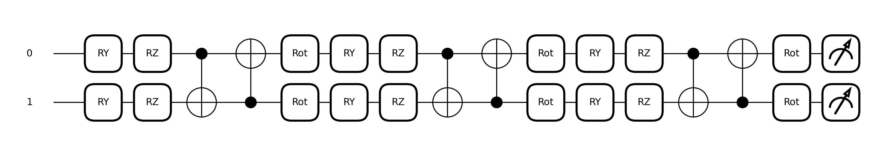

# Problem 1 分析

## 題目背景

目標函數為 `f(x1, x2) = sin(exp(x1) + x2)`，訓練集在 `[0, 0.5]²`，測試集在 `[0.5, 1.0]²`，兩者完全不重疊。模型需要在訓練域學到曲面的結構，並外推到未見過的測試域。


由恆等式 `sin(a + b) = ⟨Z⟩`，可以用單一 qubit 在 Y 軸上依序接收 `a`、`b`、`-π/2` 三次旋轉來實現：

```
q0: ─[RY(exp(x1))]─[RY(x2)]─[RY(-π/2)]─⟨Z₀⟩
```

這個結構直接編碼了目標函數，不需要任何訓練。各實驗模型以此為基準，依序放鬆先驗假設，觀察誤差如何隨之變化。

---

## 資料集

- **目標函數**：`f(x1, x2) = sin(exp(x1) + x2)`
- **訓練域**：`[0.0, 0.5] × [0.0, 0.5]`，均勻取樣
- **測試域**：`[0.5, 1.0] × [0.5, 1.0]`，均勻取樣
- **損失函數**：MSE

`exp(x1)` 的存在使外推比一般 sin 回歸更困難——模型不只需要學習加法結構，還需要從原始的 `x1` 恢復 `exp(x1)` 這個非線性變換。

---

## 九個模型

模型從 exact 解出發，分三個家族依序放鬆先驗。

---

### Exact 家族（1 qubit，1 layer）

這三個模型使用固定的特徵 `[exp(x1), x2]`，即預先提供正確的特徵表示。

#### `quantum_exact`

無可訓練參數，直接將 `sin(a + b) = ⟨Z⟩` 的恆等式編碼入電路：

```
q0: ─[RY(exp(x1))]─[RY(x2)]─[RY(-π/2)]─⟨Z₀⟩
```

**Best test MSE ≈ 7.34e-15**，達到數值精度下限。

#### `phase_learnable`

將固定的 `-π/2` 改為可學習的 phase shift（初始化為 `-π/2`）：

```
q0: ─[RY(exp(x1))]─[RY(x2)]─[RY(φ)]─⟨Z₀⟩
     φ 初始化為 -π/2，可訓練
```

**可訓練參數：1**（φ）。**Best test MSE ≈ 1.01e-14**，5 epochs 內收斂，與 exact 解同屬一個量級。

#### `scaled_exact`

在 `phase_learnable` 基礎上，讓兩個特徵的 scale 和 bias 也可學：

```
q0: ─[RY(s₁·exp(x1)+b₁)]─[RY(s₂·x2+b₂)]─[RY(φ)]─⟨Z₀⟩
     s₁,b₁,s₂,b₂ 各自初始化為 (1,0)，φ 初始化為 -π/2
```

**可訓練參數：5**（s₁, b₁, s₂, b₂, φ）。**Best test MSE ≈ 4.79e-12**，比 exact 略差，但仍遠低於訓練型模型。

---

### Same-axis Reupload 家族（1 qubit，多 layers）

保留「同一 qubit、Y 軸」的骨架，改用多個 block 重複 encoding，每個 block 的 scale、bias 和 phase shift 均可訓練。

**每個 block 的結構**：

```
q0: ─[RY(s₁⁽ˡ⁾·f₁+b₁⁽ˡ⁾)]─[RY(s₂⁽ˡ⁾·f₂+b₂⁽ˡ⁾)]─[RY(φ⁽ˡ⁾)]─ ···
```

| 模型 | 輸入特徵 f₁, f₂ | 可訓練參數（L 層）|
|---|---|---|
| `same_axis_reupload` | `exp(x1), x2` | 4L |
| `same_axis_raw` | `x1, x2` | 4L |
| `same_axis_poly` | `poly(x1,θ), x2`（3 次多項式係數可學） | 4L + 4L（poly） |

`same_axis_reupload` 保留 `exp(x1)` 先驗；`same_axis_raw` 和 `same_axis_poly` 則移除這個先驗，測試模型能否從 raw `x1` 自行近似。

#### 代表性結果（L=2，10 epochs）

- `same_axis_reupload`：best test MSE ≈ **4.91e-3**
- `same_axis_poly`：best test MSE ≈ **2.88e-2**
- `same_axis_raw`：best test MSE ≈ **3.22e-2**

有 `exp(x1)` 先驗的版本比沒有的低約一個數量級。

---

### 2-qubit 家族

#### `twoqubit_no_reupload`

利用積化和差，將 `exp(x1)` 和 `x2` 分別 encode 到兩個 qubit，量測跨 qubit 的 correlator：

```
q0: ─[RY(exp(x1))]─⟨X₀Z₁⟩
q1: ─[RY(x2)]─────⟨Z₀X₁⟩
```

輸出 = `w₁·⟨X₀Z₁⟩ + w₂·⟨Z₀X₁⟩`（w₁, w₂ 固定為解析解）

由於 `⟨X₀Z₁⟩ = sin(exp(x1))·cos(x2)`、`⟨Z₀X₁⟩ = cos(exp(x1))·sin(x2)`，兩者相加即為目標函數。**Best test MSE ≈ 5.91e-15**。

#### `twoqubit_raw_no_reupload`

移除 `exp(x1)` 先驗，改用 raw `x1, x2`，加上 entangling block 後量測四個 observable：

```
q0: ─[RY(x1)]─●─[Rot(α₀,β₀,γ₀)]─⟨Z₀⟩, ⟨X₀Z₁⟩
              │
q1: ─[RY(x2)]─X─[Rot(α₁,β₁,γ₁)]─⟨Z₁⟩, ⟨Z₀X₁⟩
```

輸出為四個 observable 的可學習線性組合。**Best test MSE ≈ 2.03e-1**。entanglement 和多個 observable 無法補回遺失的 `exp(x1)` 先驗。

#### `same_axis_twoqubit`

將 same-axis reupload 推廣至 2 qubits：每個 block 中兩個 qubit 各自 reupload，再用 `CNOT(1→0)` 建立糾纏，最後對 `⟨Z₀⟩` 和 `⟨Z₁⟩` 做線性組合輸出。

---

## 各模型比較

| 模型 | `exp(x1)` 先驗 | Reupload | Qubits | 可訓練參數 |
|---|---|---|---|---|
| `quantum_exact` | ✓（固定） | — | 1 | 0 |
| `phase_learnable` | ✓ | — | 1 | 1 |
| `scaled_exact` | ✓ | — | 1 | 5 |
| `same_axis_reupload` (L層) | ✓ | ✓ | 1 | 4L |
| `same_axis_raw` (L層) | ✗ | ✓ | 1 | 4L |
| `same_axis_poly` (L層) | 近似 | ✓ | 1 | 8L |
| `twoqubit_no_reupload` | ✓ | ✗ | 2 | 0 |
| `twoqubit_raw_no_reupload` | ✗ | ✗ | 2 | ~10 |
| `same_axis_twoqubit` (L層) | ✓ | ✓ | 2 | 10L |

有無 `exp(x1)` 先驗是各模型表現差異的主因，qubit 數與 entanglement 的影響相對次要。

---

## 頻譜分析

Fourier spectrum 用來確認模型是否學到正確的主頻結構。

`quantum_exact` 的頻譜與 target 幾乎完全重合，與接近零的誤差一致。`same_axis_reupload` 的主頻方向已靠近 target，但幅度尚未完全對齊，對應 3D surface 上「曲率方向大致正確但仍有殘差」的現象。



---

## 結果討論

### 數字總覽

| 模型 | `exp(x1)` 先驗 | Q | L | Best Test MSE |
|---|---|---|---|---|
| `quantum_exact` | ✓ | 1 | 1 | **7.34e-15** |
| `twoqubit_no_reupload` | ✓ | 2 | 1 | **5.91e-15** |
| `phase_learnable` | ✓ | 1 | 1 | 1.01e-14 |
| `scaled_exact` | ✓ | 1 | 1 | 4.79e-12 |
| `same_axis_reupload` | ✓ | 1 | 2 | 4.91e-3 |
| `same_axis_rot` | ✓ | 1 | 2 | 5.14e-3 |
| `same_axis_twoqubit` | ✓ | 2 | 2 | 6.95e-2 |
| `same_axis_poly` | 近似 | 1 | 2 | 2.88e-2 |
| `same_axis_raw` | ✗ | 1 | 2 | 3.22e-2 |
| `twoqubit_raw_no_reupload` | ✗ | 2 | 1 | **2.03e-1** |

---

### 誤差分層

結果分三個層次：

- **～1e-14**：`quantum_exact`、`twoqubit_no_reupload`、`phase_learnable`——電路結構對應 exact 解，誤差為數值精度
- **～1e-12**：`scaled_exact`——多了 5 個可訓練參數，5 epochs 後仍接近 exact
- **～1e-3 到 1e-1**：其餘依靠訓練的模型

有無 `exp(x1)` 先驗，誤差相差超過 10 個數量級。

---

### Exact 家族

`quantum_exact` 和 `twoqubit_no_reupload` 均達到 5–7e-15，接近雙精度浮點的數值下限。

`phase_learnable`（1.01e-14）：phase offset 初始化在 `-π/2`，5 epochs 即可收斂，訓練代價幾乎可忽略。`scaled_exact`（4.79e-12）：加入 scale/bias（共 5 個參數）後略有退步，但與 exact 解仍相差不到 3 個數量級，對實際應用影響不大。

在特徵表示正確的前提下，少量訓練自由度不會破壞解的品質。

---

### Same-axis Reupload 家族

`same_axis_reupload`（4.91e-3）與 `same_axis_rot`（5.14e-3）表現相近，差距在 5% 以內。`same_axis_rot` 每個 block 多加一個完整的 `Rot(α,β,γ)`，理論上表達能力更強，但對這個問題沒有幫助——目標函數的自然結構是 RY 軸上的累加，加入其他旋轉方向只增加優化難度。

兩者比 exact 家族差約 12 個數量級：data reuploading 在每層混合重組特徵，偏離了「按順序累加在同一 qubit」的最佳路徑，5 epochs 不足以完全修正。

`same_axis_twoqubit`（6.95e-2）更差：2 qubits 的糾纏對此問題是干擾，參數空間也更大，收斂更困難。

---

### 無 `exp(x1)` 先驗

`same_axis_raw`（3.22e-2）與 `same_axis_poly`（2.88e-2）差距不大。多項式近似 `exp` 在 `[0, 0.5]` 域內稍有效果，但 3 次多項式本身的逼近誤差加上訓練不足，使整體表現未能明顯優於直接用 raw `x1`。

`twoqubit_raw_no_reupload`（2.03e-1）是所有模型中最差的：2 qubits 加上 entanglement，但缺乏 `exp(x1)` 先驗且沒有 reupload，四個 observable 的線性組合仍無法學出所需的非線性變換。

---

### 結論

`exp(x1)` 先驗是決定模型表現的主因。qubit 數、層數和 entanglement 的影響，在正確的特徵表示面前都是次要的。提供正確的特徵表示，即使只有零個可訓練參數，誤差也可達到數值精度；移除這個先驗後，即使增加模型複雜度，誤差仍高出數個數量級。
