# Problem 1 作答

## 問題背景

本題目標函數為

$$f(x_1, x_2) = \sin(e^{x_1} + x_2)$$

訓練域與測試域刻意不重疊（分別為 $[0, 0.5]^2$ 與 $[0.5, 1]^2$），因此模型必須學到可外推的結構，而不只是擬合訓練點的局部形狀。

此函數存在兩個結構上完全不同的精確量子解，奠定了後續超參數搜索的上界與分析框架：

**1-qubit same-axis reupload 精確解（`quantum_exact`）**：在單一 qubit 上依序施加 $R_Y(e^{x_1})$、$R_Y(x_2)$、$R_Y(-\pi/2)$，再量測 $\langle Z \rangle$。同軸旋轉的角度加法性使電路等效為 $\langle Z \rangle = \cos(e^{x_1} + x_2 - \pi/2) = \sin(e^{x_1} + x_2)$，1 個 qubit、0 個可學習參數即可精確表示目標函數（final test MSE $\approx 7.3 \times 10^{-15}$）。

**2-qubit no-reupload 精確解（`twoqubit_no_reupload`）**：將 $e^{x_1}$ 與 $x_2$ 分別編碼到兩個 qubit，利用和角公式 $\sin(\alpha + \beta) = \sin\alpha\cos\beta + \cos\alpha\sin\beta$ 從 $\langle X_0 Z_1 \rangle$ 與 $\langle Z_0 X_1 \rangle$ 的線性組合重建目標值，完全不依賴 data reupload（final test MSE $\approx 5.9 \times 10^{-15}$）。

這兩條精確解提供了一個方法論上的切入點：與其從一個任意設計的 ansatz 出發去搜索超參數（實驗中這樣做確實難以收斂），不如先從已知可以精確表示目標函數的電路結構開始，再逐步放鬆假設、引入可學習參數，讓模型沿著有意義的結構梯度往 data reuploading 的方向泛化。以下各小題的模型選取與分析均沿此思路展開。

## (a) Best model 的 training/test loss curve

最佳模型選取 `same_axis_reupload`（$q=1$, $L=2$）。此配置的電路在每個 layer 中依序施加 $R_Y(e^{x_1})$、$R_Y(x_2)$、$R_Y(\phi_\ell)$，利用同軸 reupload 的角度加法性，在量子電路內部自然實現 $e^{x_1} + x_2$ 的組合結構。訓練以 Adam optimizer、fixed learning rate $0.03$、batch size $64$、10 epochs 進行。

訓練結果：

- Final train MSE: $6.79 \times 10^{-5}$
- Best test MSE: $4.91 \times 10^{-3}$（低於題目要求的 $0.1$）
- Final test MSE: $6.42 \times 10^{-3}$

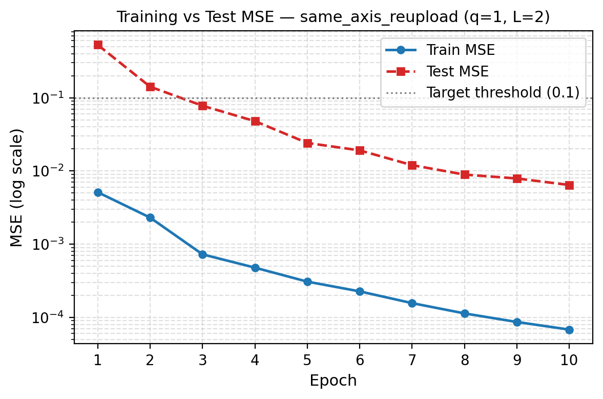

如圖所示，train MSE 與 test MSE 在整個訓練過程中均單調下降，無過擬合跡象。Test MSE 在第 3 個 epoch 即跌破 $0.1$ 閾值，至第 10 epoch 收斂至約 $6 \times 10^{-3}$。Train 與 test 之間的誤差間距（約兩個數量級）反映的是特徵先驗的校準問題：模型雖保住了正確的 additive 幾何結構，但可學習的 scale/bias 參數還未完全對齊 $e^{x_1}$ 的尺度——這是此配置的主要殘差來源，而非過擬合。

## (b) Hyperparameter/configuration 比較表

下表比較六種架構配置，涵蓋主要的結構差異：

| 模型 | Q | L | `exp(x1)` 先驗 | # Params | Best Test MSE |
|---|:---:|:---:|:---:|:---:|:---:|
| `same_axis_reupload` | 1 | 2 | ✓ | 10 | **4.91e-3** |
| `same_axis_rot` | 1 | 2 | ✓ | 16 | 5.14e-3 |
| `same_axis_poly` | 1 | 2 | 近似 | 18 | 2.88e-2 |
| `same_axis_raw` | 1 | 2 | ✗ | 10 | 3.22e-2 |
| `same_axis_twoqubit` | 2 | 2 | ✓ | 23 | 6.95e-2 |
| `twoqubit_raw_no_reupload` | 2 | 1 | ✗ | 11 | 2.03e-1 |

各模型對應的量子電路如下：

| same_axis_reupload | same_axis_rot |
|:---:|:---:|
| 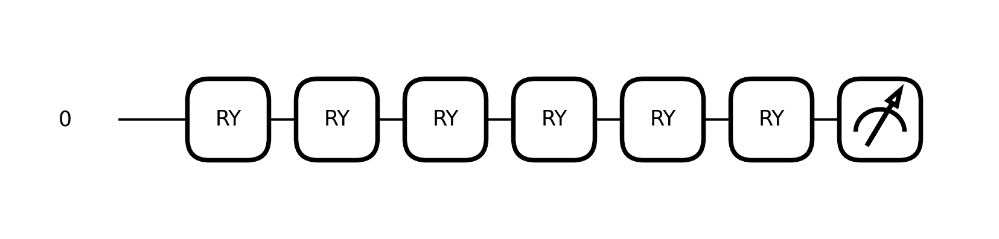 | 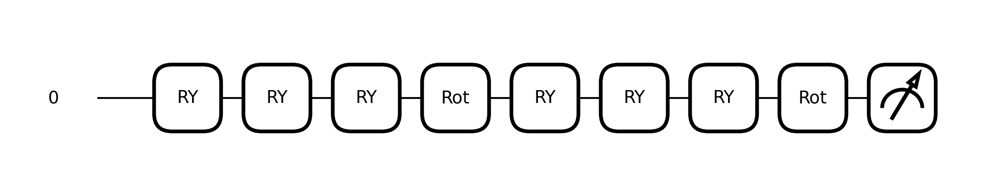 |

| same_axis_poly | same_axis_raw |
|:---:|:---:|
|  |  |

| same_axis_twoqubit | twoqubit_raw_no_reupload |
|:---:|:---:|
| 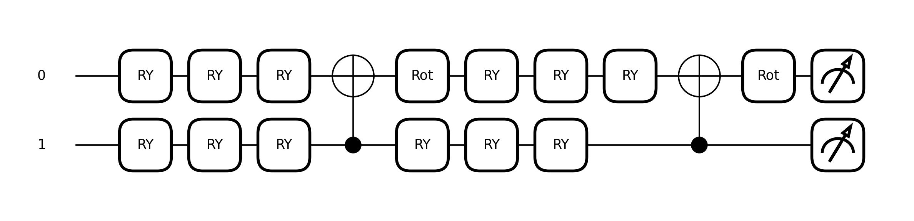 | 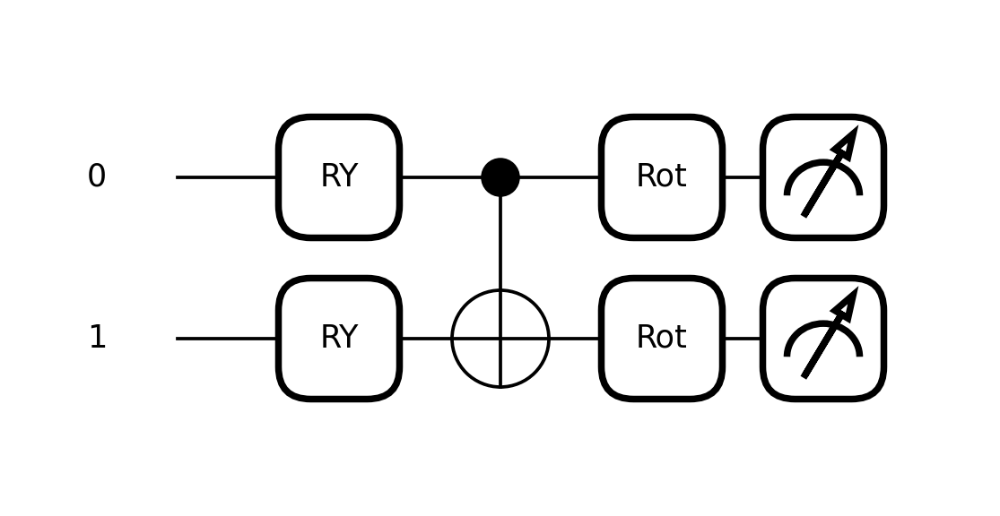 |

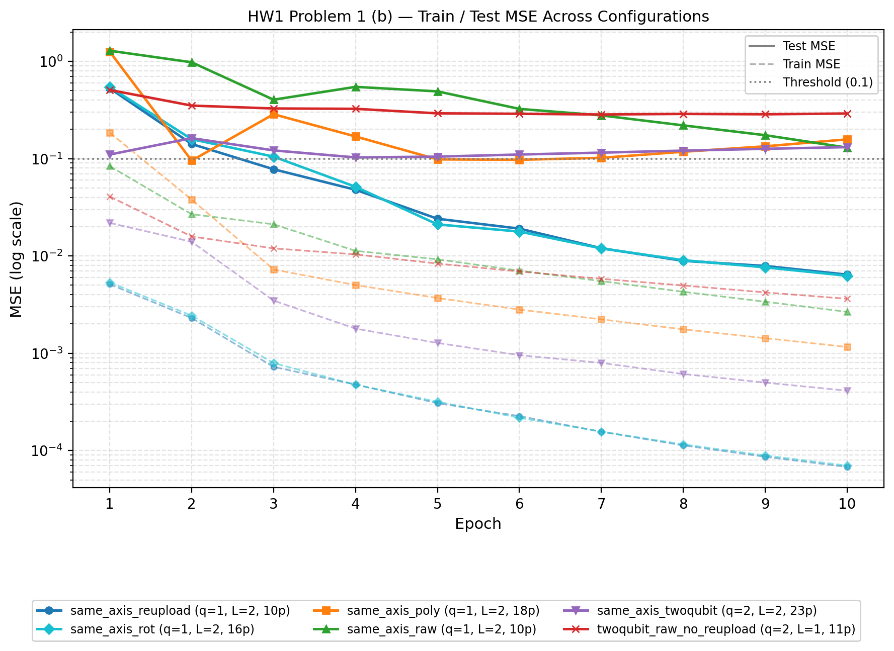

上圖將六組配置的 train MSE（虛線）與 test MSE（實線）畫在同一張圖上，log scale 下兩群自然分開。從 test MSE 可以觀察到明顯的分群：`same_axis_reupload` 與 `same_axis_rot` 從第一個 epoch 起就持續下降並突破 $0.1$ 閾值；`same_axis_poly` 和 `same_axis_raw` 在中段有所進展但最終穩定在較高水平；`same_axis_twoqubit` 收斂更慢；`twoqubit_raw_no_reupload` 的 test MSE 幾乎橫向不動，始終停在 $0.2$ 以上。值得注意的是，train MSE 的排序與 test MSE 幾乎相反——train 收斂最快的未必能外推到測試域——這再次說明本題的核心挑戰在於結構先驗，而非優化本身。

以下為幾個重要觀察：

**先驗結構是最關鍵的超參數。** `same_axis_reupload` 與 `same_axis_raw` 的 qubit 數、layer 數、可學習參數數完全相同，唯一差異是前者直接以 $e^{x_1}$ 作為第一個 rotation angle，後者改用 raw $x_1$。僅此差異便造成約一個數量級的 test MSE 差距（$4.91 \times 10^{-3}$ 對 $3.22 \times 10^{-2}$），說明內部表示是否能對齊 $e^{x_1}$ 遠比其他超參數更重要。

**增加參數量不保證改善泛化。** `same_axis_poly` 用 18 個參數試圖以可學習的三次多項式近似 $e^{x_1}$，test MSE 反而比 10 參數的 `same_axis_reupload` 差近六倍。過度的參數自由度在此反而稀釋了結構先驗。值得注意的是，`same_axis_poly` 的 test MSE 在 epoch 2–4 出現明顯的下凹再回升——這個特徵只有把整段訓練曲線畫出來才能看到，背後的幾何原因與頻率解釋詳見 (c)。

**增加 qubit 數不保證改善泛化。** `same_axis_twoqubit` 用 23 個參數和 2 qubits，test MSE 卻是 $6.95 \times 10^{-2}$，明顯差於 1-qubit 的版本。額外的 qubit 引入更大的參數空間，同時破壞了原本乾淨的 same-axis additive 結構，造成更難收斂的訓練動態。`twoqubit_raw_no_reupload` 則更進一步驗證了這點：即便加上 entanglement，若沒有正確的 $e^{x_1}$ 先驗，模型也無法從 raw inputs 自行學出所需的非線性內部表示。

## (c) Fourier spectrum 分析

根據 Ref. [1]，data reuploading 電路的輸出可以寫成輸入的有限 Fourier 級數。對於 $L$ 層、1-qubit 的 same-axis reupload，可訪問的頻率集合由電路中每個輸入出現的次數決定：若每個變數在每層各上傳一次，則在第 $\ell$ 層的貢獻使可達頻率集合擴展一個單位，對 $L$ 層而言最高頻率為 $L$，對應的頻譜為

$$f(x_1, x_2) = \sum_{\omega_1 \in \Omega_1,\, \omega_2 \in \Omega_2} c_{\omega_1 \omega_2} \, e^{i(\omega_1 x_1 + \omega_2 x_2)}$$

其中 $\Omega_1, \Omega_2 \subseteq \{-L, \ldots, L\}$。本題目標函數 $\sin(e^{x_1} + x_2)$ 在 $x_2$ 方向只需一個頻率分量（$\omega_2 = \pm 1$），但在 $x_1$ 方向的有效頻率取決於 $e^{x_1}$ 的 Taylor 展開，因此需要多層才能捕捉高階分量。

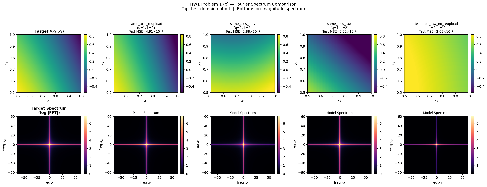

然而，單看 2D heatmap 和 Fourier spectrum 有一個實際困難：四組模型的上排 2D 輸出圖在色彩上差異微妙，不容易直接判斷曲面幾何；spectrum 的能量分佈差異也需要一定解讀門檻。以下先對 spectrum 逐一說明，再用 3D 曲面圖補充，讓頻率空間的差異與幾何行為對應起來。

**Target**：spectrum 呈現集中的十字型結構，能量主要分佈在低頻的 $\omega_{x_2}$ 軸，反映 $\sin(\cdot + x_2)$ 對 $x_2$ 的單頻依賴，以及 $e^{x_1}$ 在測試域上近似線性的緩慢展開。

**`same_axis_reupload`**：主頻位置與 target 對齊良好，十字型結構清晰可見，但整體幅度略低。Spectrum 的這個特徵對應到 3D 曲面上「方向正確、幅度欠校準」的殘差——

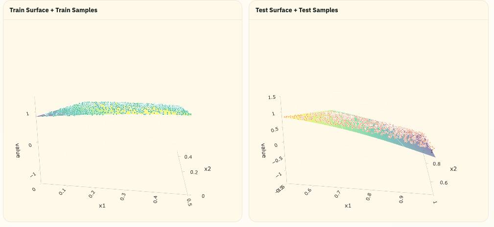

Train domain 曲面貼合樣本點，弧度正確；test domain 延續了相同的下彎曲率，整體幾何方向正確，與 (a) 中分析的 scale/bias 校準未完全收斂一致。

**`same_axis_poly`**：十字型輪廓尚存，但 $\omega_{x_1}$ 方向的能量分布與 target 明顯不對稱。這個頻率空間的非對稱性對應到一個特殊的幾何失敗：

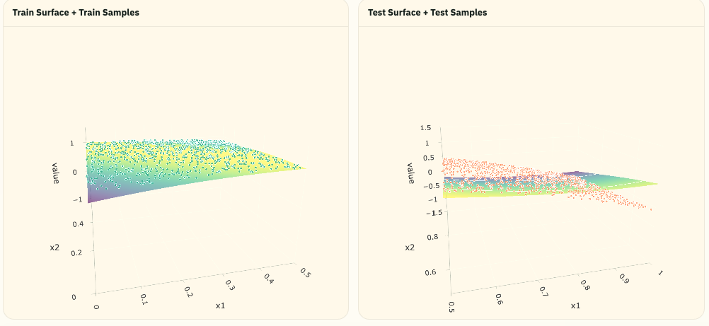

Poly 最終學出來的 train surface 傾斜方向是反的——曲面從 $x_1 = 0$ 側的高值向 $x_1 = 0.5$ 側往下傾，而 target 在訓練域內的 $x_1$ 方向應是向上的。這代表多項式係數在訓練過程中經歷了一次方向翻轉：模型先在某個較低的 test MSE 暫時駐留，隨後係數繼續更新、整個曲面轉向，穩定到最終的鏡像解。這正是 (b) loss curve 上 epoch 2–4 出現下凹再回升的來源——Fourier spectrum 中 $\omega_{x_1}$ 方向能量的不對稱，是這次翻轉留下的頻率空間印記。

**`same_axis_raw`**：十字型能量輪廓尚存，但明顯更為分散，高頻噪訊增加。以 raw $x_1$ 代替 $e^{x_1}$，模型試圖用 $x_1$ 的低階 Fourier 分量去近似所需的非線性組合，能量洩漏至不相關的頻率位置——

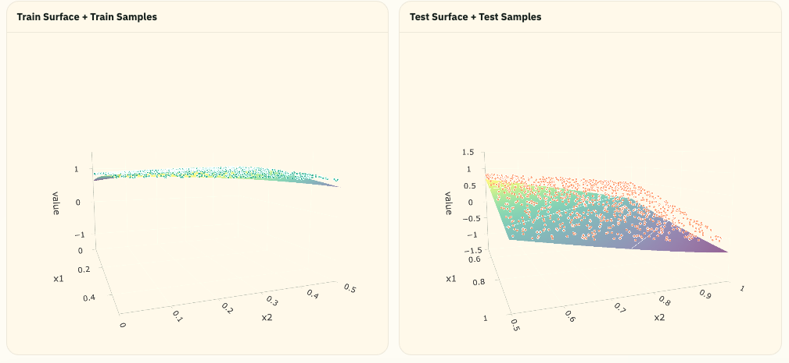

對應到 3D 上，train domain 曲面比 `same_axis_reupload` 更平，四個角落的弧度明顯不足；test domain 雖仍有斜度，但幅度偏小，test MSE 約高出六倍。

**`twoqubit_raw_no_reupload`**：十字型結構幾乎消失，能量分佈混亂，只剩極低頻的直流分量（DC term）。Ref. [1] 指出電路深度直接決定 Fourier series 的截斷頻率；此模型缺乏 $e^{x_1}$ 先驗且只做一次 encoding，可達頻率集合最為受限，這在 3D 曲面上表現得最為直接——

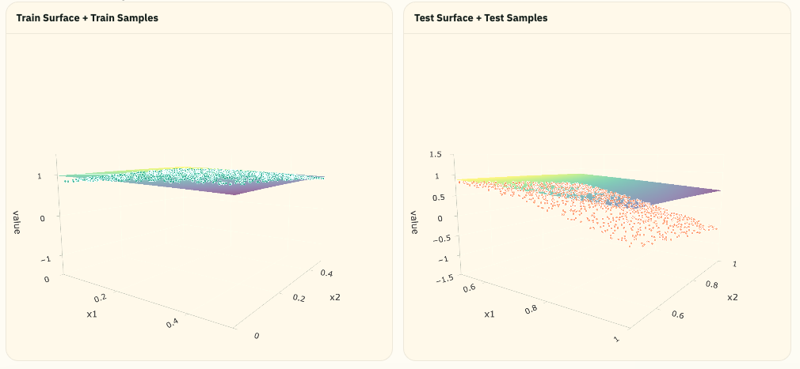

Train domain 曲面幾近一片平板，停在 value ≈ 1 附近，四個角落均明顯偏離樣本點——模型退化為對訓練集的加權平均，無法學到任何有效弧度。其直接後果是 test domain 也輸出一個幾乎不彎曲的平面，浮在 $[0.5, 1]$ 的高度，無法跟隨測試點向下彎至負值。這正是 Fourier spectrum 中十字型結構消失的幾何詮釋：模型學不到 $\omega_{x_2} = \pm 1$ 的主頻分量，自然也就無法產生任何方向上的正弦曲率。

綜合兩種視角，本題的核心瓶頸在於：可達的 Fourier 頻率集合是否包含 target 的主頻結構。`same_axis_reupload` 之所以表現最好，正是因為其電路結構保住了最對齊 target 頻率的組合方式——而這一點，在 Fourier spectrum 中是十字型能量的對齊程度，在 3D 曲面中則是 train 與 test 兩側的弧度是否能同步再現。
