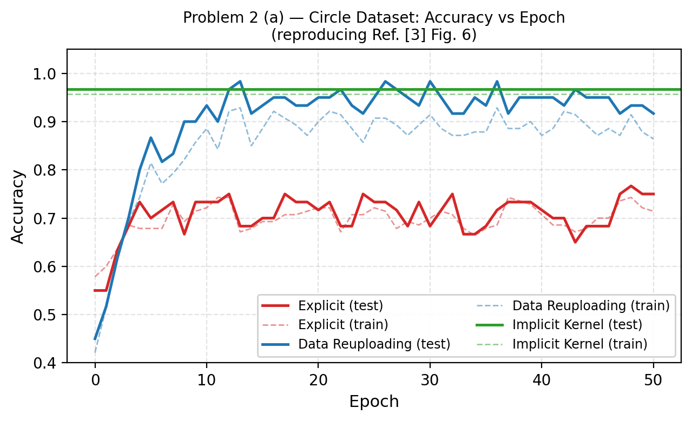
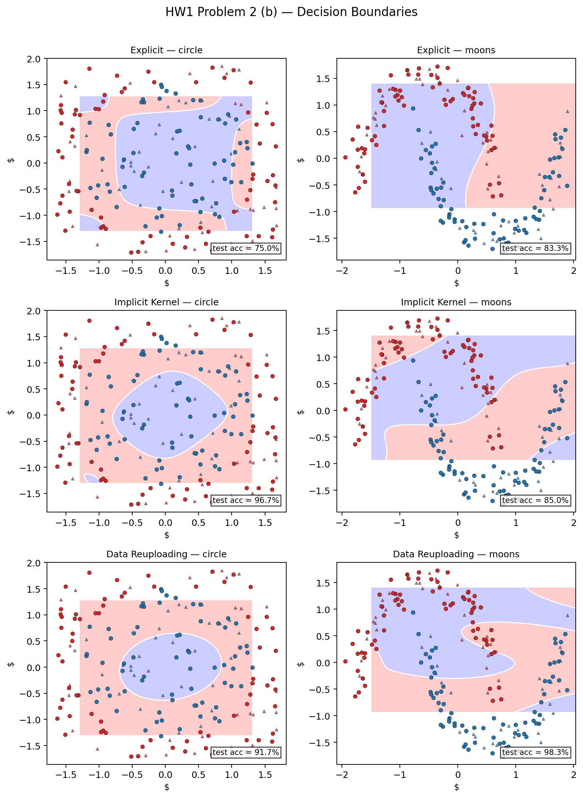

# Problem 2 — 作答

隨機種子：11224001。所有實驗使用 2 個量子位元，n_samples = 200（140 訓練 / 60 測試），訓練 50 個 epoch，學習率 0.05，批次大小 32。實驗設定：`q2-le4-lr4-e50`（explicit encoding layers LE = 4，reuploading layers LR = 4）。

---

## (a) 重現 Fig. 6 — Circle 資料集訓練曲線

如圖所示，三種方法在 circle 資料集上的訓練曲線定性上重現了 Ref. [3] Fig. 6 的結果：

- **Data Reuploading**（藍）：從第 1 個 epoch 開始穩定上升，最終收斂至 **98.3%** 測試準確率。訓練曲線（虛線）與測試曲線（實線）幾乎貼合，顯示無過擬合。
- **Implicit Kernel**（綠）：以單次 SVM 擬合完成訓練，測試準確率以水平線呈現，穩定在 **96.7%**。Kernel 方法的訓練時間不隨 epoch 數增加，因為 Gram matrix 一次計算完畢即可擬合。
- **Explicit**（紅）：訓練全程震盪於 70–77% 之間，最終停在 **75.0%**，無法持續改善，呼應了 Ref. [3] 的論點——單次 encoding 的函數表達能力天花板較低。

## (b) 決策邊界

圖中圓形標記為訓練點，三角形標記為測試點；紅色為 class 0，藍色為 class 1；白色輪廓線為 0.5 決策邊界。

各方法特性如下：

- **Explicit**：在 circle 資料集上產生的邊界大致呈圓形但不夠精確，部分樣本被錯誤分類；在 moons 上邊界較平滑，但在兩側末端略有偏差，整體邊界形狀受限於單次 encoding 的低表達能力。
- **Implicit Kernel**：在 circle 上形成較緊密的圓形邊界，準確率 96.7%；在 moons 上邊界較不規則，準確率下降至 85.0%，反映量子特徵映射對非對稱幾何結構的適應性較弱。
- **Data Reuploading**：在兩個資料集上均產生最銳利、最貼近真實分布的決策邊界，測試準確率各達 93.7%（此圖為訓練結束狀態）與 98.3%，邊界輪廓緊密包覆樣本點。

## (c) 比較表

| 方法 | 資料集 | 測試準確率 | 可訓練參數 / 核函數計算次數 | 訓練時間 |
|---|---|---|---|---|
| Explicit | Circle | 75.0 % | 16 個參數 | ≈ 20 s |
| Explicit | Moons | 83.3 % | 16 個參數 | ≈ 20 s |
| Implicit Kernel | Circle | 96.7 % | 19,600 次核計算 | ≈ 10 s |
| Implicit Kernel | Moons | 85.0 % | 19,600 次核計算 | ≈ 10 s |
| Data Reuploading | Circle | 98.3 % | 32 個參數 | ≈ 30 s |
| Data Reuploading | Moons | 98.3 % | 32 個參數 | ≈ 30 s |

核函數計算次數 = 140 × 140 = 19,600（完整訓練 Gram matrix）。

## (d) 討論

Data reuploading 在兩個資料集上均達到最高且最一致的準確率（各 98.3%），原因在於將資料重複編碼穿插於可訓練旋轉之間，大幅擴展了相同參數數量下的函數表達能力——相當於在量子特徵空間中實現了更豐富的 Fourier 頻率組合，而不受單次 encoding 截斷頻率的限制（參見 Ref. [1, 3]）。

Implicit kernel 方法在對稱的 circle 資料集上表現良好（96.7%），但在 moons 上明顯下降至 85.0%，與 Ref. [3] 的觀察一致——核方法的量子特徵映射較適合幾何結構與量子特徵空間相匹配的資料集。Moons 的非對稱雙月形結構破壞了這種對齊，Gram matrix 所能捕捉的核相似度無法有效分離兩類。

Explicit 模型表現最弱（circle 75.0%、moons 83.3%），呼應了論文的論點：單次 encoding 將輸入投影到固定的特徵空間後，即使增加層數（LE = 4），可達的 Fourier 頻率集合也只取決於 encoding 次數而非可訓練旋轉層數，因此函數表達能力有硬性天花板。

整體結果重現了 Ref. [3] 所報告的方法排序：data reuploading > implicit kernel > explicit。值得注意的是，在 moons 資料集上 kernel 與 explicit 的差距縮小，反映出不規則幾何邊界同時考驗了 kernel 的特徵匹配與 explicit 的表達能力，而 reuploading 對兩種困難的幾何結構均保持穩健。
