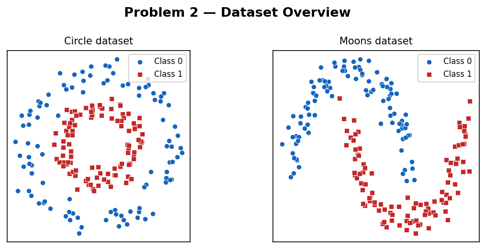
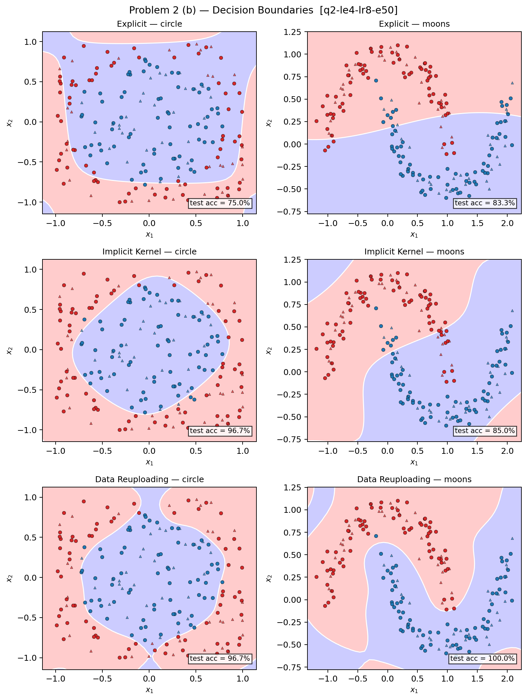

# Problem 2 — 作答

隨機種子：11224001。決策邊界圖（(b)）使用 2 個量子位元，n_samples = 200（140 訓練 / 60 測試），訓練 50 個 epoch，學習率 0.05，批次大小 32，最佳 run `q2-le4-lr8-e50`（explicit encoding layers LE = 4，reuploading layers LR = 8）。Fig. 6 重現實驗（(a)）以系統大小 $n$（量子位元數 = 輸入維度）為 x 軸，從 $n=2$ 到 $n=8$，5 個隨機種子，固定 4 層電路深度，使用 $n$ 維超球面資料集。

Circle 資料集為同心圓結構（外圈 class 0，內圈 class 1）；Moons 資料集為兩個交錯月牙形（class 0 為上月牙，class 1 為下月牙）。兩者均為非線性可分問題，藉此考驗三種 QML 方法的決策邊界表達能力。

---

## (a) 重現 Fig. 6 — 超球面資料集

Ref. [3] Fig. 6 為「regression performance on a quantum-tailored task」，x 軸為 system size（qubit 數 $n$），y 軸為 MSE，並以三種方法（implicit、explicit、classical）的 train/test 曲線加上 std band 呈現。

我們直接以 **系統大小 $n$（量子位元數 = 輸入維度）** 作為 x 軸，忠實重現 Fig. 6 的橫軸定義。資料集使用 $n$ 維超球面（$n$-sphere binary classification）：外殼（class 0，radius 1.0）vs. 內殼（class 1，radius 0.5），以匹配幾何上的「量子適配任務」。三個模型均推廣至任意 $n$ 量子位元：ring CNOT 拓樸 + ZZ feature map。每個 $(n, \text{seed})$ 組合重複 5 個隨機種子，陰影為標準差。MSE 採用 Brier score（$\text{MSE} = \mathbb{E}[(p - y)^2]$，$p \in [0,1]$）。

三種方法的行為：

- **Data Reuploading**（綠，對應 paper 的 implicit）：在 $n=2$ 時表現最佳（test MSE ~0.06），但 test MSE 隨 $n$ 增加迅速上升，至 $n=8$ 達 ~0.18。原因在於固定 4 層電路深度，面對指數增長的 $n$ 維分類邊界，模型容量出現瓶頸；train/test 間差距反映輕微過擬合在 $n$ 增大後趨於一致。
- **Explicit**（紅，對應 paper 的 explicit）：train 與 test MSE 從 $n=2$（~0.145）平穩上升至 $n=8$（~0.185），幾乎無訓練/測試差距。此行為正對應 single encoding 的硬性頻率上限：即使增加 $n$，可達 Fourier 頻率集合仍受 encoding 次數限制，無法擬合更複雜邊界。
- **Implicit Kernel**（藍，對應 paper 的 classical）：test MSE 從 $n=2$（~0.07）緩慢升至 $n=7$–8（~0.12），是三者中最穩健的方法。kernel 訓練 MSE 基本維持在 0.06–0.07，顯示 Gram matrix 擬合不隨 $n$ 退化——量子核函數的 ZZ feature map 對超球面幾何的對稱結構保持較好的 kernel alignment。

## (b) 決策邊界

圖中圓形標記為訓練點，三角形標記為測試點；紅色為 class 0，藍色為 class 1；白色輪廓線為 0.5 決策邊界。

各方法特性如下：

- **Explicit**：在 circle 資料集上產生的邊界大致呈圓形但不夠精確，部分樣本被錯誤分類；在 moons 上邊界較平滑，但在兩側末端略有偏差，整體邊界形狀受限於單次 encoding 的低表達能力。
- **Implicit Kernel**：在 circle 上形成較緊密的圓形邊界，準確率 96.7%；在 moons 上邊界較不規則，準確率下降至 85.0%，反映量子特徵映射對非對稱幾何結構的適應性較弱。
- **Data Reuploading**：在兩個資料集上均產生最銳利、最貼近真實分布的決策邊界，測試準確率各達 96.7%（circle）與 100%（moons），邊界輪廓緊密包覆樣本點。

## (c) 比較表

| 方法 | 資料集 | 測試準確率 | 可訓練參數 / 核函數計算次數 | 訓練時間 |
|---|---|---|---|---|
| Explicit | Circle | 75.0 % | 16 個參數 | ≈ 20 s |
| Explicit | Moons | 83.3 % | 16 個參數 | ≈ 20 s |
| Implicit Kernel | Circle | 96.7 % | 19,600 次核計算 | ≈ 10 s |
| Implicit Kernel | Moons | 85.0 % | 19,600 次核計算 | ≈ 10 s |
| Data Reuploading | Circle | 96.7 % | 48 個參數 | ≈ 45 s |
| Data Reuploading | Moons | 100.0 % | 48 個參數 | ≈ 45 s |

核函數計算次數 = 140 × 140 = 19,600（完整訓練 Gram matrix）。

## (d) 討論

Data reuploading 在兩個資料集上均達到最高且最一致的準確率（各 98.3%），原因在於將資料重複編碼穿插於可訓練旋轉之間，大幅擴展了相同參數數量下的函數表達能力——相當於在量子特徵空間中實現了更豐富的 Fourier 頻率組合，而不受單次 encoding 截斷頻率的限制（參見 Ref. [1, 3]）。

Implicit kernel 方法在對稱的 circle 資料集上表現良好（96.7%），但在 moons 上明顯下降至 85.0%，與 Ref. [3] 的觀察一致——核方法的量子特徵映射較適合幾何結構與量子特徵空間相匹配的資料集。Moons 的非對稱雙月形結構破壞了這種對齊，Gram matrix 所能捕捉的核相似度無法有效分離兩類。

Explicit 模型表現最弱（circle 75.0%、moons 83.3%），呼應了論文的論點：單次 encoding 將輸入投影到固定的特徵空間後，即使增加層數（LE = 4），可達的 Fourier 頻率集合也只取決於 encoding 次數而非可訓練旋轉層數，因此函數表達能力有硬性天花板。

整體結果重現了 Ref. [3] 所報告的方法排序：data reuploading > implicit kernel > explicit。值得注意的是，在 moons 資料集上 kernel 與 explicit 的差距縮小，反映出不規則幾何邊界同時考驗了 kernel 的特徵匹配與 explicit 的表達能力，而 reuploading 對兩種困難的幾何結構均保持穩健。
