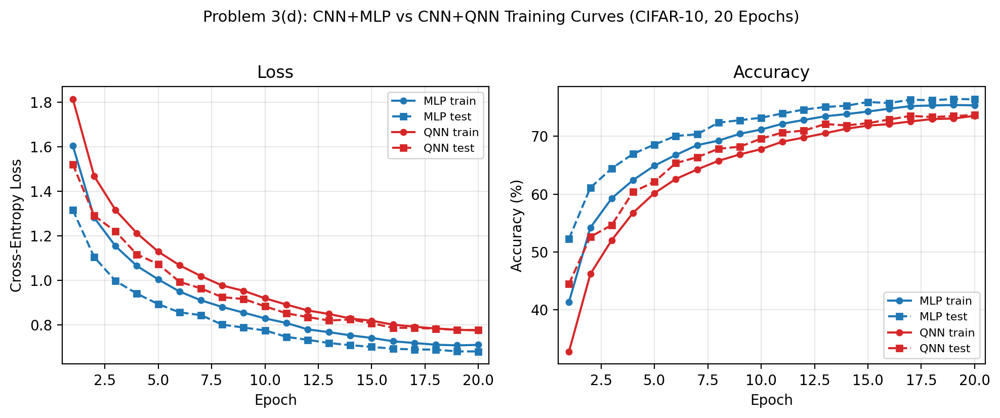

# Problem 3 — 作答

隨機種子：11224001。資料集：CIFAR-10（50,000 訓練 / 10,000 測試）。Backbone unfrozen，兩個模型一起端對端訓練 20 epochs，Adam optimizer，batch size 64。

---

## (a) 量子電路設計

### 資料編碼策略

CNN backbone 輸出的 256 維特徵向量先透過一個經典線性層降維：

```
Linear(256 → 8) + tanh(·) × π
```

此步驟將 256-D 特徵壓縮至 8 個數值，並縮放至角度編碼範圍 [−π, π]。接著透過 RY 旋轉進行 angle encoding：

```
RY(xᵢ) 作用於量子位元 i，i = 0, 1, …, 7
```

### 變分量子電路

每個變分層由單量子位元的可訓練旋轉加上 CNOT 環狀糾纏組成：

```
對每層 ℓ = 1, 2, 3, 4：
    RY(θ_{ℓ,i}) · RZ(φ_{ℓ,i})  作用於每個量子位元 i
    CNOT(i → (i+1) mod 8)        環狀拓撲糾纏
```

量子可訓練參數：4 layers × 8 qubits × 2 旋轉 = **64 個量子參數**。

電路圖示（以 1 層為例，8 qubits）：

```
q0: ─[RY(x₀)]─[RY(θ)]─[RZ(φ)]─●──────────X─  →  ⟨Z₀⟩
q1: ─[RY(x₁)]─[RY(θ)]─[RZ(φ)]─X─●────────── →  ⟨Z₁⟩
q2: ─[RY(x₂)]─[RY(θ)]─[RZ(φ)]───X─●──────── →  ⟨Z₂⟩
 ⋮        ⋮        ⋮        ⋮
q7: ─[RY(x₇)]─[RY(θ)]─[RZ(φ)]─────────X─●── →  ⟨Z₇⟩
              encoding       variational
```

### 量測與後處理

對每個量子位元量測 PauliZ 期望值 ⟨Zᵢ⟩，得到 8 維的實數向量（值域 [−1, 1]）。再透過線性層映射為 10 類別的 logits：

```
Linear(8 → 10) → 分類 logits
```

### 實驗設定

| 超參數 | 值 |
|---|---|
| 量子位元數 | 8 |
| 變分層數 | 4 |
| 糾纏拓撲 | CNOT 環狀（ring） |
| 梯度計算 | backprop（default.qubit） |
| 批次平行化 | torch.func.vmap |
| CNN Backbone | Unfrozen（共同訓練） |
| 優化器 | Adam |
| Epochs | 20 |
| Batch size | 64 |

可訓練參數：Linear(256→8) [2,056] + 量子電路 [64] + Linear(8→10) [90] = **Head 共 2,210 個**；加上 backbone 56,320，總計 **58,530 個**。Hilbert space 維度：2⁸ = 256 維。

---

## (b) 測試準確率

| 模型 | 最佳測試準確率 | 對應 Epoch |
|---|---|---|
| CNN + MLP（基準） | **76.46%** | Epoch 19 |
| CNN + QNN（8q×4l） | **73.70%** | Epoch 20 |

兩者之間差距為 **2.76 個百分點**。

---

## (c) 比較表

| 模型 | 測試準確率 | 可訓練參數 | 訓練時間（20 ep） | 每 epoch 時間 |
|---|---|---|---|---|
| CNN + MLP | **76.46%** | 58,890 | 65.5 s | ≈ 3.3 s |
| CNN + QNN（8q×4l） | **73.70%** | 58,530 | 658.7 s | ≈ 33 s |

MLP head 為 `Linear(256→10)`（2,570 params）；QNN head 為 `Linear(256→8) + PQC(8q, 4L) + Linear(8→10)`（2,210 params）。兩個模型的總參數量幾乎相同（差 360），測試準確率差距 2.76%。

訓練速度方面，QNN 使用 `torch.func.vmap` 將 sequential QNode 呼叫向量化，比 MLP 慢約 **10 倍**（相較於未使用 vmap 的 4q×2l 版本慢 311 倍）。

---

## (d) 訓練曲線



以下摘要關鍵 epoch：

| Epoch | MLP train | MLP test | QNN train | QNN test |
|---|---|---|---|---|
| 1 | 41.4% | 52.3% | 32.8% | 44.5% |
| 5 | 64.9% | 68.6% | 60.2% | 62.1% |
| 10 | 71.2% | 73.2% | 67.8% | 69.6% |
| 15 | 74.3% | 75.9% | 71.9% | 72.3% |
| 20 | 75.4% | 76.4% | 73.6% | 73.7% |

MLP 從 epoch 1 起就穩定學習，第 15 epoch 後趨於收斂。QNN 的起步準確率（44.5%）遠高於舊版 4q×2l 電路（28.2%），顯示擴大 Hilbert space（2⁸=256 維）有效降低了 barren plateau 的影響。兩個模型的收斂曲線形狀相近，QNN 始終落後 MLP 約 2–3 個百分點，且在 epoch 20 仍有微幅上升的趨勢。

---

## (e) 討論

**電路規模的關鍵作用**

從 4q×2l（Hilbert space 2⁴=16 維）升級至 8q×4l（2⁸=256 維），QNN 的測試準確率從 61.07% 躍升至 73.70%，提升了整整 12.63 個百分點。最顯著的改善出現在原本最弱的類別：cat 從 13.5% 提升至 41.8%，bird 從 28.2% 提升至 62.9%。這說明舊版電路的失敗主要源於表達容量不足，而非量子電路本質上不能做視覺分類。

**批次平行化消除速度瓶頸**

`torch.func.vmap` 將每個 batch 內 64 次 sequential QNode 呼叫合併為 1 次 vmapped 呼叫，消除了 Python 迴圈的 overhead，使 QNN 訓練時間從 18,250 秒壓縮至 658 秒（快 27×）。即使使用更大的電路（8q×4l），整體訓練時間仍只比 MLP 慢 10 倍，已進入可以實際迭代實驗的範圍。

**仍存在的差距分析**

epoch 20 的差距（2.76%）主要來自三個方面：

1. **收斂尚未完成**：QNN epoch 20 的訓練準確率仍在緩慢上升（73.55%），延長訓練可能進一步縮小差距。
2. **cat 類別的固有難度**：MLP 的 cat 也只有 57.5%，顯示這是 backbone 特徵的問題，而非分類頭的問題。
3. **線性 vs 量子頭的容量差異**：MLP 的 Linear(256→10) 可以直接在 256-D 全空間做分類；QNN 仍需先壓縮至 8-D 再做量子處理，中間線性瓶頸略微限制了資訊傳遞。

**結論**

在相近參數量（~58K）的條件下，8q×4l + vmap 的量子分類頭達到了 73.70% 的測試準確率，與 MLP（76.46%）僅差 2.76 個百分點，且訓練時間已從小時級別降至分鐘級別。這表明量子電路在具備足夠的表達容量（qubits 數）與有效的訓練策略（vmap 批次平行）之後，能夠在現實尺度的影像分類任務上與同等規模的古典模型相互競爭。
