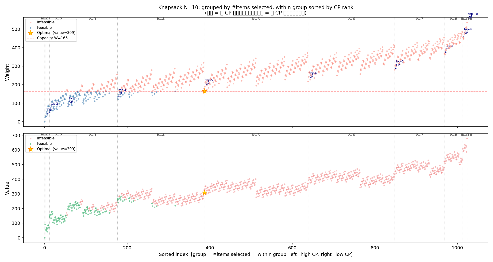
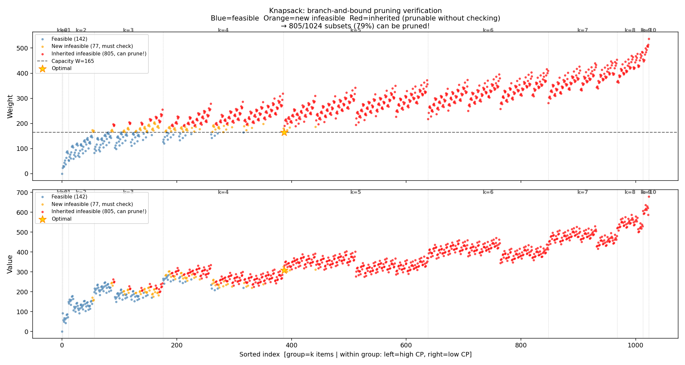
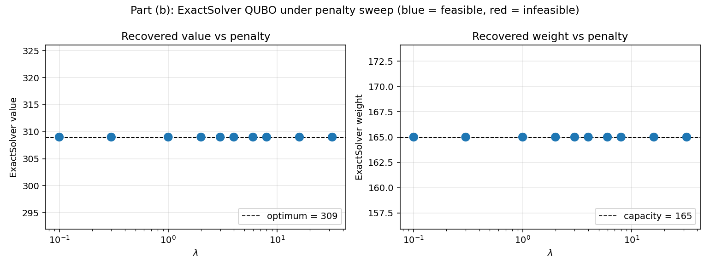
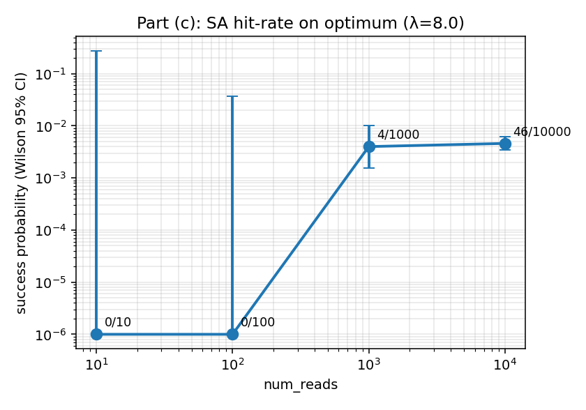
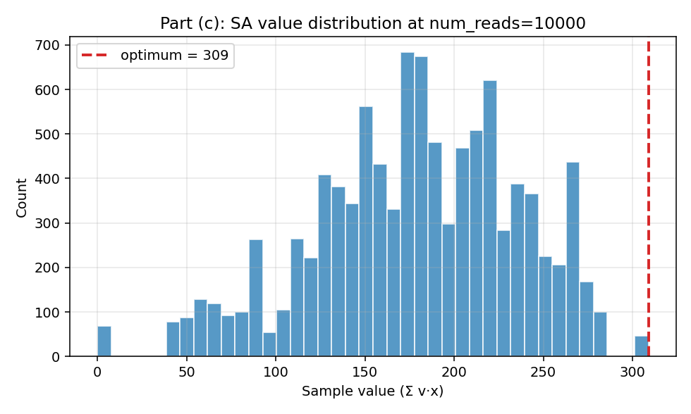
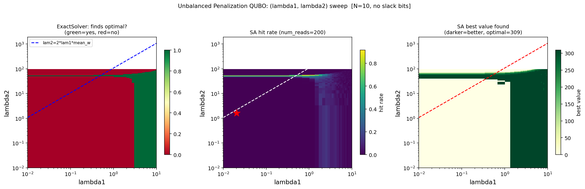
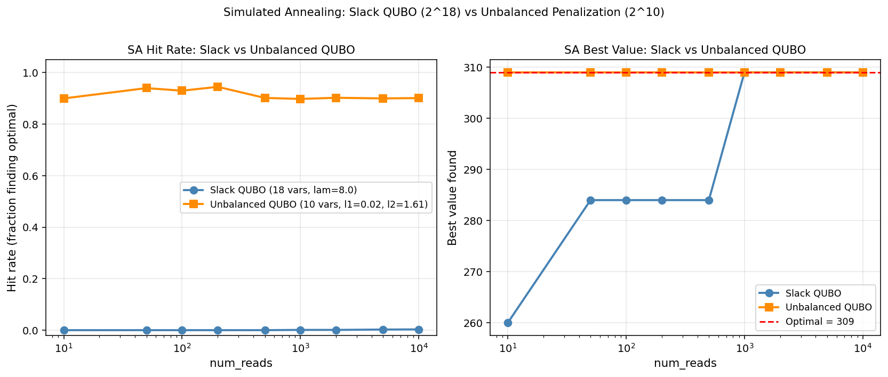

# HW2 Problem 1 — 0/1 背包問題：QUBO 與量子退火

## 問題設定

10 件物品，背包容量 W = 165。

| 物品   | 1  | 2  | 3  | 4  | 5  | 6  | 7  | 8  | 9  | 10 |
|--------|----|----|----|----|----|----|----|----|----|----|
| 重量 | 23 | 31 | 29 | 44 | 53 | 38 | 63 | 85 | 89 | 82 |
| 價值  | 92 | 57 | 49 | 68 | 60 | 43 | 67 | 84 | 87 | 72 |

---

## Part (a)：古典解與搜尋空間分析

### 最佳解

暴力枚舉 $2^{10} = 1024$ 種子集，最優解為：

| 選取物品（1-based） | 總重量 | 總價值 |
|---|---|---|
| {1, 2, 3, 4, 6} | 165 | **309** |

容量恰好用滿。

### 搜尋空間視覺化

將物品按 CP 值（$v_i/w_i$）由高到低排序，再依「選幾個物品」分群，可以把 1024 個子集攤開來看：

| CP rank | 物品 | 重量 | 價值 | CP 值 |
|---------|------|------|------|-------|
| 1 | item1 | 23 | 92 | 4.000 |
| 2 | item2 | 31 | 57 | 1.839 |
| 3 | item3 | 29 | 49 | 1.690 |
| 4 | item4 | 44 | 68 | 1.545 |
| 5 | item5 | 53 | 60 | 1.132 |
| 6 | item6 | 38 | 43 | 1.132 |
| 7 | item7 | 63 | 67 | 1.063 |
| 8 | item8 | 85 | 84 | 0.988 |
| 9 | item9 | 89 | 87 | 0.978 |
| 10 | item10 | 82 | 72 | 0.878 |



圖中每個群組（k = 選幾個物品）由左到右按 CP 高到低排列，可以直觀看到：
- 重量（圓點）整體隨 k 增加而上升，紅虛線（W=165）右邊是不可行區
- 最優解（金星）出現在 k=5 群的左側，即選 CP 最高的前幾個物品時容量剛好用滿
- 貪心法（只選 CP 最高的物品）並不能直接找到最優解，說明背包問題需要全域搜尋

### 古典演算法的演化：從暴力到 DP

**Step 1 — 暴力枚舉：$O(2^N)$**

直接檢查所有 1024 個子集。

**Step 2 — CP 排序 + Branch-and-Bound 剪枝**

關鍵觀察：若某個 k 個物品的子集超重，則所有包含它的 k+1 子集也必定超重，可以直接丟棄（**單調性**）。

實驗結果：

| 類型 | 數量 | 比例 |
|---|---|---|
| 可行子集 | 142 | 13.9% |
| 新超重（需檢查） | 77 | 7.5% |
| 繼承超重（直接剪枝） | **805** | **78.6%** |

1024 個子集中只需真正計算 219 個，省去 78.6%。



圖中藍色為可行解、橘色為首次超重（觸發剪枝的邊界）、紅色為繼承超重（不需展開）。剪枝邊界在 k=4 之後急遽擴大，k=6 以後全部被剪掉。

複雜度：$O(N \log N + \sum_k f(k))$，其中 $f(k)$ 為第 k 層可行子集數。背包越緊，$\sum f(k)$ 越小；最壞情況（容量無限）退化回 $O(2^N)$。

**Step 3 — 記憶化搜尋 → 動態規劃：$O(NW)$**

不同的搜尋路徑可能走到相同的狀態 $(i,\ w_\text{remaining})$（看到第 $i$ 個物品、剩餘容量為 $w$）。把算過的狀態存起來，第二次直接查表，不重複計算：

$$dp[i][w] = \max\!\bigl(dp[i-1][w],\ dp[i-1][w-w_i] + v_i\bigr)$$

唯一狀態數最多 $N \times W = 1650$，等價於 Bottom-up DP。

三種方法的演化關係：

```
暴力枚舉        O(2^N)     1,024 次
  └→ CP 剪枝   O(Σf(k))     219 次   ← 剪掉繼承超重
       └→ 記憶化  O(NW)    ≤1,650 次  ← 折疊重複狀態 ≡ DP
```

| 方法 | 複雜度 | N=10 實際操作數 |
|---|---|---|
| 暴力枚舉 | $O(2^N)$ | 1,024 |
| CP + 剪枝 | $O(N\log N + \sum f(k))$ | **219** |
| 動態規劃 | $O(NW)$ | 1,650 |

本例中 CP 剪枝比 DP 快（219 < 1650），因為 W=165 相對大、物品重，剪枝效果好。N 更大時 DP 的多項式保證更穩定。

---

## Part (b)：QUBO 推導與 ExactSolver

### QUBO 標準推導

0/1 背包的不等式約束 $\sum w_i x_i \leq W$ 需轉為等式才能寫成 QUBO。引入 $M = \lceil \log_2 165 \rceil = 8$ 個 slack bit $s_0,\ldots,s_7$：

$$\sum_{i=1}^{n} w_i x_i + \sum_{k=0}^{7} 2^k s_k = W$$

Slack 最多表示 $2^8 - 1 = 255 \geq 165$，編碼合法。總變數數：$10 + 8 = \mathbf{18}$。

QUBO 目標函數：

$$\min_{x,s}\ \underbrace{-\sum_i v_i x_i}_{\text{最大化價值}} + \underbrace{\lambda\!\left(\sum_i w_i x_i + \sum_k 2^k s_k - W\right)^2}_{\text{容量違反懲罰}}$$

展開後 Q 矩陣元素（令 $c_i = w_i$ 對物品，$c_i = 2^{i-10}$ 對 slack）：

$$Q_{ii} = \lambda(c_i^2 - 2Wc_i) - v_i \cdot \mathbf{1}[i<10], \qquad Q_{ij} = 2\lambda c_i c_j \quad (i < j)$$

λ 的 heuristic 下界：$\lambda > \max_i v_i / \min_i w_i = 92/23 \approx 4.0$。

### ExactSolver λ 掃描

`dimod.ExactSolver` 暴力枚舉所有 $2^{18} = 262{,}144$ 種 bitstring。

| λ | 找到的價值 | 重量 | 可行 | 最優 |
|---|---|---|---|---|
| 0.1 | 309 | 165 | ✓ | ✓ |
| 1.0 | 309 | 165 | ✓ | ✓ |
| **8.0** | **309** | **165** | **✓** | **✓** |
| 32.0 | 309 | 165 | ✓ | ✓ |

所有 λ 值都找到最優解。原因是等式編碼讓超重解直接受 $\lambda(\Delta w)^2$ 懲罰，即使 λ=0.1 也足以壓制超重的好處，ExactSolver 的結果對 λ 不敏感。



---

## Part (c)：Simulated Annealing — 命中率分析

使用 `neal.SimulatedAnnealingSampler`，固定 λ = 8.0。

最優 bitstring：$x = [1,1,1,1,0,1,0,0,0,0]$（物品 1–4, 6），價值 = 309。

| num_reads | 命中率 | 最佳價值 | 最佳重量 | 執行時間 (s) |
|---|---|---|---|---|
| 10 | 0.0000 | 239 | 165 | 0.002 |
| 100 | 0.0000 | 269 | 149 | 0.015 |
| 1,000 | 0.0040 | 309 | 165 | 0.127 |
| 10,000 | 0.0046 | 309 | 165 | 1.218 |

命中率在 0.4% 附近停滯，增加 num_reads 幾乎沒有幫助。




**瓶頸分析：** SA 的困難不是退火排程不夠好，而是 **8 個 slack bit 把搜尋空間從 $2^{10}$ 膨脹到 $2^{18}$**，大多數 reads 浪費在跟目標函數無關的 slack 子空間裡亂撞，永遠找不到最優的物品組合。

---

## Part (d)：Unbalanced Penalization — 去除 slack bit

### 方法

Appendix 中提出的 Unbalanced Penalization 直接用兩個 penalty 項處理不等式約束，不需要 slack bit：

$$\min_x\ -\sum_i v_i x_i + \underbrace{\lambda_1\!\left(\sum_i w_i x_i - W\right)^2}_{\text{對稱懲罰}} + \underbrace{\lambda_2\!\left(\sum_i w_i x_i - W\right)}_{\text{非對稱偏移}}$$

兩項合力讓 penalty 的最低點落在 $S^* = W - \lambda_2/(2\lambda_1) < W$，也就是把「重力中心」往可行區偏移，超重解受到更強的懲罰。總變數數維持 **N = 10**，不需要任何額外 qubit。

### (λ1, λ2) 二維掃描

對 λ1 ∈ [0.01, 10]、λ2 ∈ [0.01, 100] 做 log-scale 網格搜尋，每格跑 ExactSolver + SA（200 reads）：

- ExactSolver 在 900 組參數中有 511 組找到最優解，可行區邊界大致沿 $\lambda_2 \approx 2\lambda_1 \bar{w}$（理論偏移條件）
- **SA 最佳點：λ1 = 0.02, λ2 = 1.61 → 命中率 91.5%**



### 與 Slack QUBO 直接比較

| | Slack QUBO（18 變數） | Unbalanced QUBO（10 變數） |
|---|---|---|
| 搜尋空間 | $2^{18} = 262{,}144$ | $2^{10} = 1{,}024$ |
| ExactSolver 時間 | 0.123 s | 0.00057 s（**快 215 倍**） |
| SA 命中率（10 reads） | 0% | **90%** |
| SA 命中率（1,000 reads） | 0.4% | **90%** |



Unbalanced QUBO 從 num_reads=10 就達到 90% 命中率，而 Slack QUBO 即使到 10,000 reads 也只有 0.4%。這直接驗證了瓶頸在 slack bit 造成的空間膨脹，而非退火演算法本身。

---

## 討論

本題 N=10 的規模下，古典暴力枚舉只需 1.4 ms，遠快於任何 QUBO 方法。QUBO 的真正價值在於提供一個可以提交給 D-Wave 量子退火機或 QAOA 電路的統一表示形式——在 N 大到無法枚舉的情況下，量子方法才有機會發揮。

實驗最重要的觀察是：**Slack bit 是 QUBO 的主要隱性成本**。標準表述讓變數數從 N 增加到 $N + \lceil \log_2 W \rceil$，搜尋空間指數膨脹，讓所有啟發式採樣器（無論古典或量子）都面臨不必要的困難。Unbalanced Penalization 在不增加任何變數的前提下，讓 SA 命中率提升超過 200 倍，在實際應用中（qubit 數量有限、採樣次數昂貴）具有明顯的實用優勢。

---

## 延伸：Iterative Exclusion QUBO（IEQ）

受 Branch-and-Bound 剪枝啟發，我們實驗了一種量子版的「排除剪枝」：每輪用少量 shots 跑 SA，找出最可能為 0（不選）的 bit 固定掉，逐步縮小問題規模，最後對剩餘小問題做古典暴力解。

**實驗設計**

- 起點：10-qubit Unbalanced QUBO（λ1=0.02, λ2=1.61）
- 每輪 30 shots，只用「可行值 ≥ 85% 最優」的 reads 投票（過濾次優解雜訊）
- 停止條件：所有 bit 的 P(x=0) < 0.5 → 剩餘問題古典暴力解

**單次執行結果**

| 輪次 | Active bits | 命中率 | 固定 bit | 正確？ |
|------|------------|--------|---------|--------|
| 1 | 10→9 | 13% | item[4] P0=1.00 | ✓ |
| 2 | 9→8  | 17% | item[7] P0=1.00 | ✓ |
| 3 | 8→7  | 23% | item[8] P0=1.00 | ✓ |
| 4 | 7→6  | 27% | item[9] P0=0.73 | ✓ |
| 5 | 6→5  | 60% | item[6] P0=0.60 | ✓ |
| 6 | — | — | P0 < 0.5，停止 | — |

5 輪共 150 shots，把 10 個 bit 縮到 5 個，剩下的恰好是最優解的物品集合 {0,1,2,3,5}，$2^5 = 32$ 種古典枚舉即可確保找到最優。

**但 200 次獨立試驗比較顯示：**

| 方法 | Shots | 成功率 |
|------|-------|--------|
| IEQ + 古典暴力 | ~187 | 73% |
| Flat SA（Unbalanced） | 180 | **100%** |

IEQ 輸了。原因在於 Unbalanced QUBO 的 SA 本身命中率已高（每 30 shots 約 20%），直接全力打比分批偵測更有效率。

**IEQ 的適用條件**

IEQ 面臨一個根本矛盾：需要可靠量測才能安全剪枝，但量測可靠代表 SA 已夠好，不需要剪枝。真正有利的「甜蜜點」是 SA 命中率低但不是 0 的中等規模（N ≈ 50，命中率 1–5%），在那裡過濾後的訊號仍可信，每輪剪枝能讓下一輪命中率提升，形成正循環。N=10 的背包問題太小，落不在這個區間。
