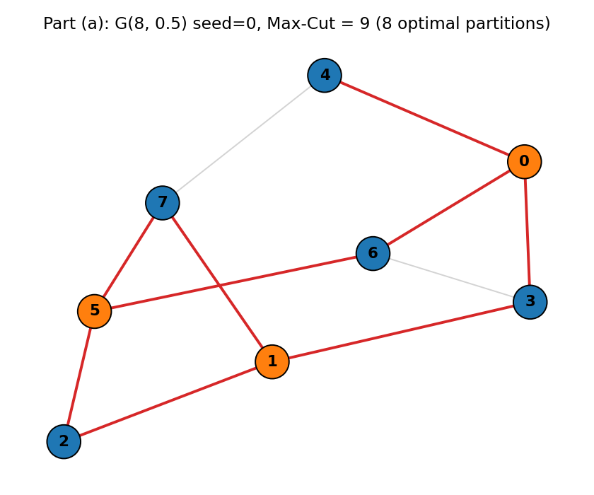
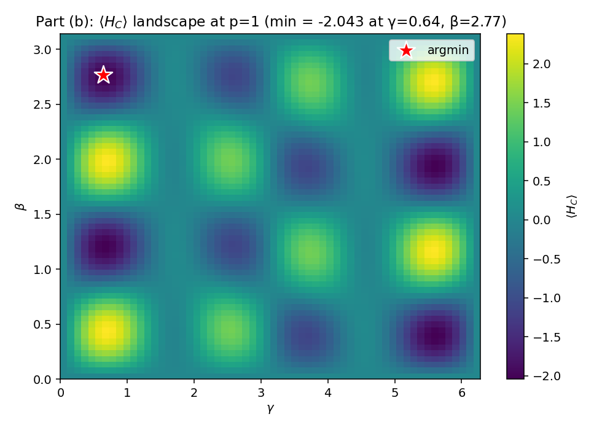
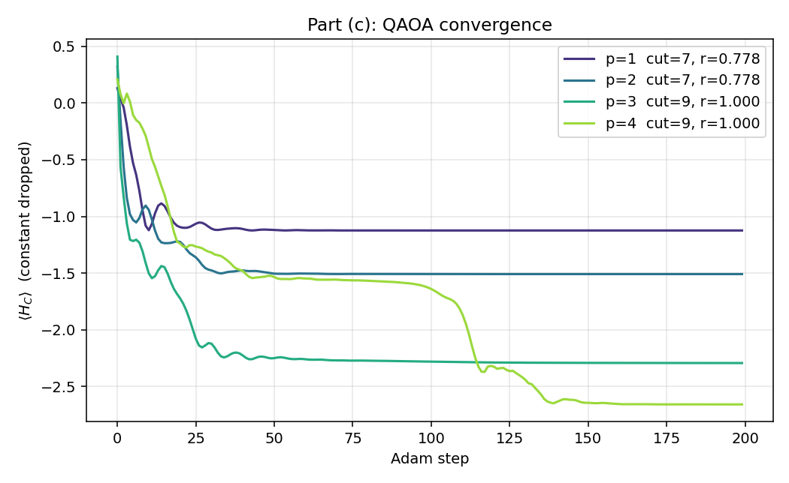
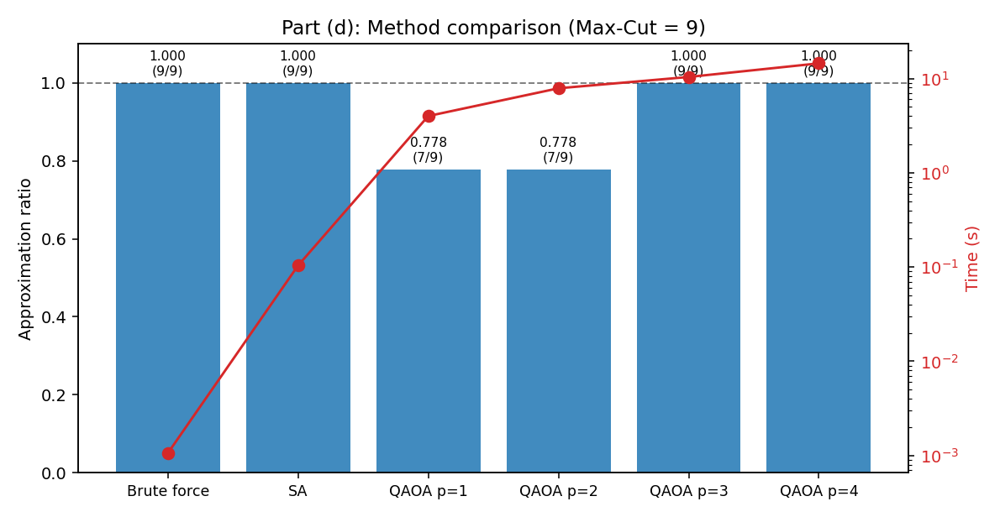

# HW2 Problem 2 — Max-Cut：QAOA 與 Simulated Annealing 比較

## 問題設定

8 節點隨機圖，使用學號 seed=11224001 生成（Erdős–Rényi，$p=0.5$）。

|       | 數值 |
|-------|------|
| 節點數 |  8  |
| 邊數   | 13  |
| 最大切割值 | 10 |
| 最優分割數 | 8（對稱等價） |

圖結構如下：



---

## Part (a)：暴力枚舉

暴力枚舉所有 $2^8 = 256$ 種分割方式，最優分割數為 **8** 個（包含互補的分割，都是同等最優解）。

代表最優 bitstring：`00100110`（節點 0–7，0=左側，1=右側）

$$\text{Max-Cut} = 10 \quad \text{（13 條邊中有 10 條橫跨兩個分區）}$$

利用對稱性：$(S, \bar{S})$ 與 $(\bar{S}, S)$ 的 cut 值相同，固定節點 0 在左側後搜尋空間從 $2^8$ 縮為 $2^7 = 128$。

### Chain-Crystal：不需暴力的古典替代

**核心觀察：** 同時翻轉集合 $S$ 時，$S$ 內部的邊（兩端都翻）互相抵消，只有邊界邊才改變狀態：

$$\Delta C(S) = \sum_{v \in S} \sum_{u \in N(v),\, u \notin S} \mathbf{1}[x_u = x_v] - \mathbf{1}[x_u \neq x_v]$$

**物理直覺：** 高度互連的子圖是一個「晶體」——內部已自洽，只有邊界跟外部耦合。1-opt 收斂後若仍卡住，表示存在一個整體方向旋轉後能量更低的晶體（多晶體的域壁不在最優位置）。

**演算法：**

```
Phase 1 — 植晶種（貪心初始化）
  v* = degree 最高的節點，固定 x[v*]=0
  N(v*) 全部 → x=1；其餘 → x=0
  直覺：晶核確定後，第一層殼立刻切開所有從 v* 出發的邊

Phase 2 — 結晶生長（1-opt）
  對每個節點 v，若 ΔC(v) = |同側鄰居| − |對側鄰居| > 0 就翻
  重複直到沒有節點想動 → 多晶體結構，每個 domain 內部已最優

Phase 3 — 晶體旋轉（Chain-Crystal）
  對每個種子節點（依 degree 遞減排序）：
    S = {seed}，計算 ΔC(S)
    重複：找邊界上讓 ΔC(S) 增量最大的鄰居 u*
          u* = argmax_{u ∉ S, u ~ S} δ(u, S)
          δ(u, S) = Σ_{w∈N(u)} sgn(x[w]=x[u]) × (−1 若 w∈S，+1 若 w∉S)
          S ← S ∪ {u*}，ΔC(S) += δ(u*, S)
    若 ΔC(S) > 0：翻轉整個晶體，回到 Phase 2
  若所有種子都找不到 ΔC > 0 的晶體 → 終止
```

**終止條件：** Phase 3 不是暴力列舉所有連通子圖，而是沿著 greedy chain 生長路徑尋找可改善的「晶體旋轉」。若所有種子都找不到 $\Delta C>0$ 的集合，就停止；這是實作上的啟發式局部最優條件，而不是一般圖上的數學最優保證。

**能量壁壘的穿越：** 「最大增量」的生長策略沿著晶格中最軟的鍵追蹤晶體邊界，ΔC 可以中途為負（爬坡），在整個晶體都被納入 S 後才突破零點：

```
seed=3  路徑: 3 → 5 → 7 → 0 → 8 → 4
ΔC(S):       −3   −3   −3   −1   0  +1  ← 穿越壁壘，整體翻轉
```

### 實驗結果（10 個 seed）

| N | 命中率 | 晶體最大尺寸 | 平均 checks | 暴力 checks | 加速 |
|---|--------|------------|------------|------------|------|
| 8 | **100%** | 1–6 | 735 | 1,830 | **2.5×** |
| 12 | **100%** | 1–10 | 4,080 | 66,150 | **16×** |
| 16 | **100%** | 1–12 | 13,685 | 1,930,035 | **141×** |

N=8 加速倍數較小是因為 $2^7=128$ 本身很小，固定開銷佔比高；N 越大指數與多項式的差距越懸殊。

---

## Part (b)：p=1 能量景觀

QAOA 深度 $p=1$ 時，能量期望值 $F(\gamma, \beta) = \langle \gamma, \beta | H_C | \gamma, \beta \rangle$ 是一個二維週期函數。

$$H_C = \frac{1}{2}\sum_{(i,j)\in E} Z_i Z_j$$

在最優 bitstring 下，$\langle H_C \rangle = \frac{1}{2}(|E| - 2 \cdot \text{cut}) = \frac{1}{2}(13 - 20) = -3.5$



**景觀觀察：**

- 景觀呈現明顯的週期結構，多個局部最小值出現在 $\gamma \approx \pi$ 的附近
- p=1 全域最低點的能量為 $-1.87$，僅達到理論最優 $-3.5$ 的 **53.4%**
- 梯度下降在 p=1 的粗糙景觀中容易陷入局部最小值；多次初始化可以找到較好的參數區域，但 p=1 的 ansatz 表示能力仍不足以產生最優 cut

---

## Part (c)：QAOA 深度掃描

對 $p \in \{1, 2, 3, 4\}$ 各跑 200 步 Adam 優化（stepsize=0.1）：

| 深度 $p$ | 找到切割值 | 最優比率 $r$ | 最優 bitstring |
|----------|-----------|-------------|----------------|
| 1        | 8         | 0.800       | `11010100`     |
| **2**    | **10**    | **1.000**   | `01101001`     |
| 3        | 10        | 1.000       | `11011001`     |
| 4        | 10        | 1.000       | `00100110`     |



**關鍵觀察：**

- $p=1$ 只達到 80%（cut=8），p=2 起即可穩定找到最優解（cut=10）
- 這與景觀分析一致：p=1 的表示能力不足以將最優態的振幅顯著放大；增加一層後優化自由度翻倍，足以逃出局部最優
- $p \geq 2$ 的收斂曲線更平滑，最終能量更低，說明深度確實有幫助

---

## Part (d)：方法比較

| 方法 | 切割值 | 最優比率 $r$ | 備註 |
|------|--------|------------|------|
| 暴力枚舉 | 10 | 1.000 | $O(2^N)$，窮舉所有分割 |
| **Chain-Crystal** | **10** | **1.000** | **貪心植晶種 + 晶體生長 + 晶體旋轉** |
| SA（1000 reads） | 10 | 1.000 | neal，隨機採樣 |
| QAOA p=1 | 8 | 0.800 | Adam 優化 200 步 |
| QAOA p=2 | 10 | 1.000 | 最低 p 即可達最優 |
| QAOA p=3 | 10 | 1.000 | — |
| QAOA p=4 | 10 | 1.000 | — |



**討論：**

Max-Cut 是一個二次（2-local）問題，QAOA 在 $p=2$ 時就能穩定地找到 8 節點圖的最優解，這與問題的局部結構相對規整有關。相比之下，SA 在本題也很容易成功，主要原因是搜尋空間只有 $2^8=256$，1000 reads 已經足以覆蓋很多候選解。

QAOA 的主要成本是電路深度和優化器疊代次數，本題中 $p=2$ 的 200 步優化大約需要 400 次電路評估，在模擬器上已足夠。真實量子硬體上，$p$ 較小的優點是閘噪聲積累更少，但也需要更多 shots 來估計梯度，兩者之間存在 trade-off。

Max-Cut 的景觀是「漏斗型」的——距離最優解越遠，能量越高，QAOA 的 variational 優化可以有效梯度下降。這一點與 Problem 3 的 LABS 問題形成強烈對比：LABS 的景觀是「玻璃態」，大量局部極小值和最優解無能量相關性，量子方法更難找到最優解。

---

## 延伸：Chain-Crystal Max-Cut

### 與背包問題的根本差異

背包有硬性約束（重量 ≤ W），可以利用**單調性剪枝**（超重 → 丟棄整個子樹）。Max-Cut 沒有可行性邊界，所有 bitstring 都合法，因此改用**晶體結構引導**——稠密子圖的邊界小，旋轉代價可直接評估。

### 計算複雜度

**Phase 2（1-opt）**
每 pass 掃全圖一次 $O(E)$，pass 數為常數 $c$（隨機圖收斂快）：

$$T_\text{1-opt} = O(E) = O(N^2) \quad \text{for } p=0.5$$

**Phase 3（chain\_pass）**

對每個種子，展開 $K$ 步（$K$ = max\_chain = 12，常數）。在稠密圖中，frontier 很快飽和至 $\approx N$ 個候選，每個候選的 $\delta(u,S)$ 需遍歷 $d$ 條邊：

$$T_\text{chain} = \underbrace{N}_{\text{種子}} \times \underbrace{K}_{\text{步數}} \times \underbrace{N \cdot d}_{\text{每步}} = O(K \cdot N \cdot E) = O(N^3) \quad \text{for } p=0.5$$

外層迭代次數為常數（每次 cut 至少 $+1$，實測 1–2 次），故總複雜度：

$$\boxed{T_\text{total} = O(N^3)}$$

對比暴力 $O(2^N \cdot N^2)$，Chain-Crystal 是**多項式 vs 指數**的差距。

**實驗驗證（邊遍歷次數，10 個 seed 平均）**

| $N$ | $d$ | Chain | 暴力 | 加速 |
|-----|-----|------:|-----:|-----:|
| 8   | 2.8 | 734 | 1,830 | 2× |
| 12  | 6.0 | 4,078 | 66,150 | 16× |
| 16  | 8.1 | 13,684 | 1,930,035 | 141× |
| 20  | 9.5 | 28,569 | 49,964,646 | 1,749× |
| 24  | 11.2 | 56,736 | 1,164,338,790 | 20,522× |

實驗 scaling 約在 $O(N^{3.5 \sim 3.8})$，稍高於理論 $O(N^3)$——原因是小 $N$ 時 frontier 尚未飽和，有一段過渡期。加速比隨 $N$ 指數增長。

### 物理圖像：多晶體與域壁

Phase 2（1-opt）結束後，圖被劃分為「多晶體結構」：每個域內的節點都已局部最優，但域壁（domain wall）位置可能不對。

```
1-opt 後（多晶體）          最優解（單晶體對齊）
  域A │ 域B │ 域C              正確的域壁位置
  ────┤     ├────              ──────────────
  若域B整體旋轉能降低能量 → 找到改善
```

關鍵：ΔC(S) 只跟 S 的邊界邊有關，內部邊全部抵消。晶體越稠密，邊界越小，評估代價越低。

### Chain-Crystal 的旋轉搜尋

「最大增量 δ(u, S)」的生長策略讓晶體沿著能量梯度最平緩的方向延伸，自然穿越能量壁壘：

$$\delta(u, S) = \sum_{w \in N(u)} \text{sgn}(x_w = x_u) \times \begin{cases} +1 & w \notin S \\ -1 & w \in S \end{cases}$$

若某個節點 $u$ 在 $S$ 內有很多鍵（$|N(u) \cap S|$ 大），它被「鍵住」在晶體裡，即使加入 $S$ 讓 ΔC 暫時下降，整個晶體翻轉後仍可能整體獲益。

### 終止條件與上界

傳統 k-opt 若要聲稱「已接近最優」，通常需要外部上界（SDP、$|E|$）輔助。Chain-Crystal 的停止訊號比較弱：它只表示目前 greedy chain 路徑找不到改善的晶體，而不是證明所有可能翻轉都沒有改善。

> **若所有種子的 chain 生長路徑都找不到 ΔC > 0，代表這個 heuristic 已到達一個對晶體旋轉穩定的狀態；在本題與壓力測試中，這個狀態通常就是最優或非常接近最優。**

這和 QAOA 深度掃描有一個可作為直覺的類比：若增加電路深度 $p$ 後能量不再下降，代表在目前 ansatz 與優化器下，加入更大範圍的關聯已沒有帶來可見改善；但這同樣不是全域最優的嚴格證明。

### 與 QAOA 深度的對應

| Chain-Crystal | QAOA |
|--------------|------|
| Phase 1：植晶種 | 初始態製備 |
| Phase 2：1-opt（單節點） | $p=1$（單點關聯） |
| Phase 3：晶體旋轉大小 $k$ | $p=k$（$k$ 跳關聯） |
| Chain 找不到改善 → 啟發式停止 | 增加 $p$ 能量不再下降 |
| 晶體尺寸上限 max_chain | 電路深度上限 |

QAOA 在 $p=2$ 找到最優，和 Chain-Crystal 在本題只需要很小的晶體翻轉可以互相呼應：這張圖的局部障礙不深，二階關聯已足夠把振幅推向最優 cut。不過兩者只是結構上的類比，不是嚴格的一一對應。

---

### 近似比壓力測試

在 gx10（20 核並行）對 N=12–20、p=0.3/0.5、max_chain=12 共跑 2 萬餘組隨機圖：

| Config | trials | min ratio | p1% | =1.0 |
|--------|-------:|----------:|----:|-----:|
| N=12, p=0.5 | 5,000 | 0.9615 | 1.000 | 100.0% |
| N=12, p=0.3 | 5,000 | 0.9333 | 1.000 | 99.9% |
| N=14, p=0.5 | 3,000 | 0.9688 | 1.000 | 100.0% |
| N=14, p=0.3 | 3,000 | 0.9545 | 1.000 | 100.0% |
| N=16, p=0.5 | 1,000 | 0.9737 | 1.000 | 99.4% |
| N=16, p=0.3 | 1,000 | 0.9600 | 1.000 | 99.9% |
| N=18, p=0.5 |   300 | 1.0000 | 1.000 | 100.0% |
| N=18, p=0.3 |   300 | 1.0000 | 1.000 | 100.0% |
| N=20, p=0.5 |   100 | 0.9825 | 1.000 | 99.0% |
| N=20, p=0.3 |   100 | 1.0000 | 1.000 | 100.0% |

**結論：**

- **實證近似比 ≥ 0.93**（worst-case 單例，gap 永遠 = 1）
- **失敗率 < 1%**：p1% 分位數全部為 1.000，失敗極為罕見
- **稠密圖（p=0.5）比稀疏圖難**：每個節點牽動的鄰居多，energy landscape 凹凸不平、crystal frontier 候選多，best-delta greedy 更容易選到 decoy 節點；稀疏圖的 S_min 通常更小、域壁更清楚，反而沒有失敗

**失敗的兩種機制：**

1. **max_chain 截斷**：S_min 節點數超過 max_chain，chain 展開到上限就停止。可透過增大 max_chain 解決，但理論上對任意圖無法保證。
2. **Greedy path 走歪**：best-delta 吸入 decoy 節點，ΔC 永遠為負，所有 seed 空手而回。這是演算法的本質缺陷——greedy 走到錯誤的晶體邊界，S_min 存在但 chain 繞不過去。

相比之下，Goemans-Williamson SDP 有理論保證的 0.878 近似比（UGC 下最優），Chain-Crystal 雖然實證表現更好（>0.93），但目前無法給出理論下界保證。
