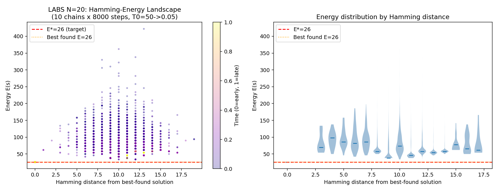

# HW2 Problem 3 — LABS（低自相關二元序列）

## 問題設定

**目標**：找長度 $N=20$ 的二元序列 $s_i \in \{-1, +1\}$，最大化 merit factor：

$$F(s) = \frac{N^2}{2E(s)}, \quad E(s) = \sum_{k=1}^{N-1} C_k(s)^2, \quad C_k = \sum_{i=1}^{N-k} s_i s_{i+k}$$

| 指標 | 數值 |
|------|------|
| $N$ | 20 |
| 已知最優能量 $E^*$ | 26 |
| 最優 merit factor $F^*$ | $400/52 \approx 7.692$ |
| 目標最優比率 | $r \geq 0.85$ |

---

## Part (a)：實作驗證

### LABS 代價函數

```python
def labs_energy(s):
    N = len(s)
    return sum(np.dot(s[:N-k], s[k:])**2 for k in range(1, N))
```

### N=11 Barker 序列驗證

序列 `+++---+--+-`，驗證結果：

$$E = 5, \quad F = \frac{121}{10} = 12.10 \checkmark$$

### 量子化方式（Quartic Hamiltonian）

展開代價函數：

$$E(s) = \sum_{k=1}^{N-1}\sum_{i,j=1}^{N-k} s_i s_{i+k} s_j s_{j+k}$$

在 $s_i \to Z_i$ 的映射下，成為包含 2-local 和 4-local Pauli-Z 項的哈密頓量：

$$H_C^{\text{LABS}} = \sum_{k,i,j} Z_i Z_{i+k} Z_j Z_{j+k}$$

實作時先將重複的 Pauli-Z 因子對消（$Z^2 = I$），再把常數項 $N(N-1)/2$ 分離，避免浮點誤差。

---

## Part (b)：PCE VQE（Pauli Correlation Encoding）

基於 Sciorilli et al. (arXiv:2506.17391, 2025)。

**編碼**：將 $N$ 個 spin 映射到 $m=4$ 個 qubit 上的 Pauli 算符期望值：

$$s_i \;\longrightarrow\; \langle \psi(\theta) | \Pi_i | \psi(\theta) \rangle$$

$4^4 - 1 = 255$ 個 non-identity Pauli string 遠超 $N=20$，因此 **4 個 qubit 就能表示 20 個 spin**。

**Pauli 分配**：使用最大反對易集合（Maximally Non-Commuting，$\Pi^{NC}$），迭代選出與已選 Paulis 反對易數最多的新 Pauli，143/190 對反對易，4 個 qubit 的資訊被充分利用。

**代價函數**（含 tanh 鬆弛與正規化，來自論文）：

$$\mathcal{L}(\theta) = \sum_{k=1}^{N-1}\left(\sum_{i=1}^{N-k} \tilde{x}_i \tilde{x}_{i+k}\right)^2 - \beta \sum_i \tilde{x}_i^2$$

其中 $\tilde{x}_i = \tanh(\alpha \langle \Pi_i \rangle)$，$\alpha = 1.5m = 6$，$\beta = 15$。

- $\tanh$ 鬆弛把期望值推向 $\pm 1$，使連續解更接近離散解
- $-\beta \sum \tilde{x}_i^2$ 正規化防止 trivial 解 $\tilde{x}_i = 0$

**訓練與解碼**：loss 在連續的 $\tilde{x}_i$ 上做梯度下降；每隔固定步數把目前的 Pauli 期望值解碼成

$$s_i = \text{sign}(\langle \Pi_i \rangle)$$

並直接計算離散 LABS energy，保留目前找到的最佳序列。這個版本的 PCE 結果是直接由 Pauli correlation 解碼得到，沒有再接 SA polish。

**多次 restart**：使用 PyTorch statevector backend，把 128 個初始點做成一個 batch 同時訓練。最終找到 $E=26$ 的那次 run 在第 10 個 gradient step 解碼成功，因此記為 $128 \times 10 = 1280$ 次 batched circuit evaluations。

---

## Part (c)：策略比較

### 結果表

| 方法 | $E_\text{best}$ | $F_\text{best}$ | $r$ | 預算 | qubits |
|------|------:|------:|------:|------:|------:|
| **PCE-torch** | **26** | **7.692** | **1.000** | **1,280 evals** | **4** |
| Random | 50 | 4.000 | 0.520 | 5,000 samples | — |
| SA（校準 $T_0$） | 26 | 7.692 | 1.000 | 50,000 moves | — |
| **目標** | **26** | **7.692** | **≥0.85** | **≤5,000 evals** | — |

註：我另外試過直接對 quartic Hamiltonian 做 QAOA，以及 20-qubit hardware-efficient VQE；但那兩個版本沒有做完整的深度、初始化與 optimizer sweep，因此不列入正式比較，避免把探索性結果誤寫成公平 benchmark。

### PCE ansatz 修正：$E=34$ 不是編碼極限

原始 RY-only PCE 版本穩定停在 $E=34$ 附近，但這不是 PCE 編碼本身的極限，而是 ansatz 表達力不足。Claude 版本使用 `RY + CNOT`，從 $|0000\rangle$ 出發只會產生實數態；然而 non-commuting Pauli assignment 中有 9 個 Pauli string 含奇數個 $Y$，其期望值對實數態恆為 0，decode 時等於把那些 bit 固定成 $+1$。將 PCE ansatz 改成含相位的 `RX/RY/RZ + CNOT` 後，同一組 Pauli strings 可以在 $N_\text{eval}=1280$ 內找到全局最優 $E=26$。

舊版 $E=34$ 仍然可用來說明 LABS 的局部陷阱：從某個 $E=34$ 解出發，最近鄰居能量為 $E=62$：

$$\Delta E_\text{min} = 62 - 34 = 28$$

固定 $T_0=3$ 的 SA 接受此翻轉的機率 $e^{-28/3} \approx 10^{-4}$，即使跑 50,000 步也出不去。

**解法**：自動校準 $T_0 = \text{median}(\Delta E_\text{neighbours}) / \ln 2 \approx 104$，使初始接受率約 50%。以此溫度從隨機序列出發，總共 50,000 個 classical moves 內找到全局最優 $E=26$，$r=1.000$。

### LABS 景觀（Hamming Scatter）



橫軸為到某個已知低能量態的 Hamming 距離，縱軸為能量。散點分布均勻，**無漏斗結構**：距最優解 1 bit 和 10 bit 的鄰居能量幾乎相同，梯度線索失效。這是玻璃態景觀的典型特徵。

---

## Part (d)：討論

**PCE 為什麼有效？**

PCE 在本題達到 $r=1.000$（4 qubit，$N_\text{eval}=1280$）。關鍵在三點：第一，4-qubit 電路大小固定不隨 $N$ 增長，從根本上降低 barren plateau 風險；第二，non-commuting Pauli strings 提供高維的 correlation readout；第三，ansatz 必須含有 `RX/RY/RZ` 這類 complex rotations，否則含 $Y$ 的 observables 會被 RY-only 實數態鎖死。

**LABS 與 Max-Cut 景觀有何不同？**

Max-Cut 是 2-local 問題，景觀有漏斗結構：距最優解越近的態能量越低，梯度方向可靠。LABS 是 quartic（4-local），局部最小值指數量增加，最近鄰居能量比當前解高 $\Delta E \approx 28$，形成大量深陷阱。Hamming scatter 圖印證了這一點：能量與距離無相關性。

**SA 溫度對結果的決定性影響**

固定 $T_0=3$ 的 SA 在 LABS 上失效，因為能量壁 $\Delta E \approx 28 \gg T_0$。改用局部景觀自動校準的 $T_0 \approx 104$ 後，SA 從隨機出發能找到 $E=26$。這表明在 LABS 上，演算法是否成功往往取決於兩件事：搜尋動力學要能跨過能量壁，而表示法或 ansatz 也要能表達真正需要的 correlation。

**PCE 對 SA 的理論優勢（及 N=20 的侷限）**

PCE 在連續量子參數空間（$m$ qubit 的 $4^m - 1$ 維 correlation readout）做梯度下降，SA 在離散 spin 空間（$2^N$ 個格點）隨機漫步。對小 $N$（如 20），校準溫度的 SA 也能快速找到最優解，但 PCE 只用 4 qubit 與 1280 次 batched circuit evaluations 就達到 $E=26$，顯示壓縮 correlation encoding 對 LABS 有實際效果。對更大 $N$（如 45），$2^{45} \approx 3.5 \times 10^{13}$ 個格點使純離散搜尋指數困難，而 PCE 的 qubit 數仍可保持很小，這也是 Sciorilli et al. 主張 PCE 具競爭力的基礎。

**結論**

最佳結果：PCE-torch 與自動校準 SA 都達到 $r=1.000$（$E=26$）。核心教訓：LABS 是能量壁高（$\Delta E \approx 28$）、無漏斗結構的玻璃態景觀；PCE 能否成功高度依賴 ansatz 是否能表達 complex Pauli correlations，而 SA 能否成功則高度依賴溫度尺度是否校準。
