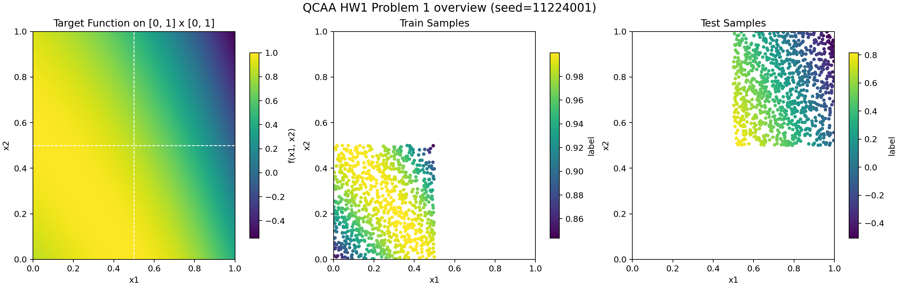

# Problem 1 分析

這個頁面現在不再主打舊的 qubit/layer 大矩陣，而是改成沿著題目本身的結構，從「可以精確做出答案的量子路徑」一步一步往外放鬆。

## 題目背景

Problem 1 的目標函數是 `f(x1, x2) = sin(exp(x1) + x2)`。資料切法不是一般的隨機插值，而是刻意把 train domain 放在 `[0.0, 0.5] x [0.0, 0.5]`，test domain 放在 `[0.5, 1.0] x [0.5, 1.0]`。換句話說，模型必須先在左下角看一小塊曲面，再把這個結構推到右上角沒有直接看過的區域。

這也是為什麼這一題的重點不是單純把 train loss 壓低，而是看模型能不能保住正確的曲率與相位結構。

## 為什麼要改成結構化主線

前一版比較像是從 generic ansatz 出發，用很多 projection、encoding 和電路排列組合去猜。那條路的問題是模型雖然有很多自由度，但很難判斷到底是量子路徑不夠，還是前面的 generic 設計先把題目結構洗掉了。

後來我們發現這題其實有一個非常乾淨的量子解：

- 同一個 qubit 上連續做 `RY(exp(x1))`
- 再做 `RY(x2)`
- 最後補一個 `RY(-pi/2)`
- 量測 `PauliZ`

因為同軸 reupload 會把角度加起來，所以這條路徑幾乎就是直接在量子電路裡實現 `sin(exp(x1) + x2)`。

## 目前這個頁面裡的幾組結果在看什麼

現在的主線可以分成四層：

1. `quantum_exact`
2. `phase_learnable`
3. `scaled_exact`
4. `same_axis_reupload`

前三個是從 exact 解一步一步放鬆：

- `quantum_exact`：直接用固定結構做答案
- `phase_learnable`：只把 `-pi/2` 改成可學參數
- `scaled_exact`：再讓 `exp(x1)` 和 `x2` 前面可以學 scale / bias

第四個 `same_axis_reupload` 才是第一個比較像「真正 data reuploading 模型」的版本：

- 還是保留同一個 qubit、同一個 rotation axis
- 但不再只做單一 block
- 而是用多個 reupload blocks 去學同一個 backbone

## 這一輪最重要的結論

這幾組 `e10` 的結果很清楚：

- `quantum_exact` final test MSE 約 `7.34e-15`
- `phase_learnable` final test MSE 約 `5.77e-11`
- `scaled_exact` final test MSE 約 `2.06e-10`
- `same_axis_reupload (q1, l2)` best test MSE 約 `4.91e-03`

這代表兩件事。

第一，題目本身不是量子 data reuploading 做不到。只要保住「同 qubit、同軸、角度相加」這個核心結構，量子路徑可以幾乎精確重建答案。

第二，第一個比較泛化的 `same_axis_reupload` 雖然還不能 exact-fit，但它學到的已經不是亂的面。它會沿著正確的曲率方向往答案靠近，這比前一版 generic baseline 有意義得多。

## 怎麼看 `same_axis_reupload`

如果只看數字，`same_axis_reupload-q1-l2-e10` 還有明顯誤差：

- final train MSE 約 `6.79e-05`
- final test MSE 約 `6.42e-03`

但這組最重要的不是它還差多少，而是它已經學到對的幾何家族。也就是說，現在的誤差比較像校準還沒完全對齊，而不是模型根本沒抓到題目的主結構。

這也是為什麼目前更合理的方向，是沿著 same-axis backbone 做小幅泛化，而不是回到舊的 projection-heavy 架構。

## 這個頁面要怎麼看

最建議的看法是：

1. 先看 `quantum_exact`，把它當成結構參考解。
2. 再看 `phase_learnable` 和 `scaled_exact`，確認小幅放鬆後是不是還能維持這個解。
3. 最後看 `same_axis_reupload`，觀察真正的 data reuploading 版本離這個參考解還差多少。
4. 用 slider 拖過訓練過程，特別注意 test domain 曲面的曲率是怎麼長出來的。

## 頻譜在這裡的角色

Fourier spectrum 在這個頁面的用途，不是單純補一張漂亮圖，而是幫忙確認模型是不是抓到了對的主頻結構。

`quantum_exact` 的主頻和 target 幾乎重合，這和它幾乎零誤差是一致的。`same_axis_reupload` 雖然幅度還沒有完全對上，但主頻位置已經沿著正確方向靠近 target。這個訊號和 3D surface 上看到的曲率學習，是互相對應的。

## 目前的工作假設

到目前為止，最合理的假設是：

- Problem 1 最重要的 inductive bias 是同 qubit、同軸 reupload
- 一旦把 `exp(x1)` 和 `x2` 拆散，或先丟進過度 generic 的 projection，模型就比較容易偏掉
- 真正值得做的泛化，不是丟掉 exact backbone，而是保留它，再一小步一小步增加自由度
